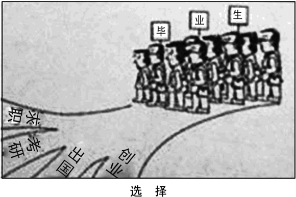
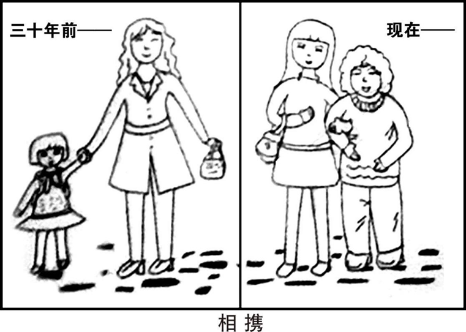
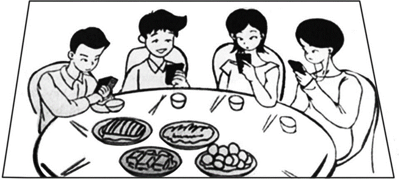

# 作文

Copyright © 2025 virtual小满 All rights reserved. 
一般使用/表示多个可替换(同义或反义)的表达，单个词经常使用/，词组经常使用 / (多了空格)。用[]标识该词组的界限范围，[]内用/区分各个词组。用()表示可出于篇幅等因素而省略或者自行替换为实际主题词的文本，()里可能只列举一个主题词，但实际作文里可以写两个关键词。尽可能保证词汇在考纲内。
参考deepseek，ChatGPT；黄皮书真题答案；石雷鹏《30个功能句》、《冲刺20篇》。

## 通用高级表达

### 高级替换
https://chat.qwen.ai/c/8db66608-c89b-47f3-a16e-2f6c44eb42e4

| 原词 | 替换词 | 示例 |
| --- |:--- | --- |
| **so**        | therefore / thus / **accordingly** / consequently |    |
| **very**      | extremely / remarkably / profoundly / rather / exceedingly    |  exceedingly complex  |
| **important** | **imperative** / **indispensable** / crucial / essential / significant / vital / notable |   |
| **happy**     | pleased / content / delighted |   |
| **many**      |  numerous / **considerable** / substantial / **diverse** / myriad / manifold / innumerable / a multitude of |   |
| **mainly**    | to a large extent / predominantly / substantially  |   |
| **some**      | several / a proportion of(部分) / a handful of(少量) |   |
| **huge**      | enormous / immense / **tremendous** / gigantic / colossal |   |
| **small**     | minor / **negligible** / insignificant / slight / modest |   |
| **good**      | beneficial / rewarding / favorable / advisable / **sensible** / appropriate / superior / fabulous / intelligent |   |
| **bad**       | **adverse** / detrimental / negative / unfavorable / deleterious | negative impact / adverse effects        |
| cheap         | inexpensive / economical / cost‑efficient  |   |
| **think**     | consider / contemplate / contend / advocate      |   |
| **get**       | obtain / receive / acquire / attain |  receive feedback / acquire skills / attain goals |
| start         | commence |   |
| **show**      | demonstrate / illustrate / reveal  | reveal insights  |
| **help**      | assist / support/ facilitate |   |
| **like**      | be keen on  |  |
| **damage**    | **diminish** / compromise / **undermine** / obstruct |   |
| **in order to** | **aiming to** / **seeking to** / **with the intention/aim of** / with a view to / so as to(不能句首) / for the purpose of |   |

注：profoundly 通常修饰抽象概念，attain 多用于抽象目标
cultivate$\sim$stimulate $\longleftrightarrow$ stifle$\sim$undermine
uphold $\longleftrightarrow$ violate
~~depend on~~ $\to$ hinge on 取决于
~~famous~~ $\to$ renowned/celebrated 著名的
~~ability~~ $\to$ capability/competence 能力
~~goodness~~ $\to$ virtue/merit/morality 美德
~~stick to~~ $\to$ adhere to/abide by 遵守
~~enjoy~~ $\to$ savor 享受
~~obvious~~ $\to$ self-evident 不言而喻的

### 更好的套话
【**每篇必用**】 **unwavering resolve 坚定的决心, unceasing/unremitting/painstaking effort 不懈/艰苦的努力**
【**每篇必用**】 transform once-impossible visions into **tangible** realities,   transform **daunting** tasks into manageable steps,   transform setbacks into stepping stones,   transform potential into tangible achievements.
【**personality**】 diligence, **perseverance**, resilience, optimism, confidence, innovation 勤奋、毅力、韧性、乐观、自信、创新
【**夸人**】 down-to-earth=practical=sensible=unpretentious!=pretentious=arrogant 可形容personality/advice/perspective/lifestyle
【**修饰主语**】 is characterized/distinguished/marked by ... 以...为特色

【**描述缺点**】 (A pessimistic disposition/mindset/outlook / Pessimism) **blinds** them to any hope or opportunity, **let alone** the possibility/capacity of change. / **renders** them **incapable of** recognizing opportunities in challenges, consistently **mistaking setbacks for failures**. / **leaving aspirations unfulfilled and potential untapped**.
【**描述优点**】 (A persistent mindset) enables/allows them to **uncover**/seize possibilities in setbacks where others see none, consistently **turning perseverance/attempts into triumph**.
【**描述缺点**】 It **inevitably places long-lasting constraints on** their prospects and **undermines** their potential for meaningful advancement.(可以改为society’s和its，或environment's和its)
【**描述优点**】 It **serves to open up long-lasting opportunities** for students and to **enhance** their potential for meaningful advancement.
【**描述缺点**】 Far from being a mere attitude, a pessimistic mindset constricts intellectual horizons and impedes sustained growth, thereby eroding the very foundations upon which meaningful progress or transformation rests/depends.
【**描述优点**】 Far from being a mere attitude, a persistent mindset broadens intellectual horizons and fosters sustained growth, thereby reinforcing the very foundations upon which long-term progress or transformation rests.

【**阐述建议**】 Solving this problem is by no means an overnight endeavor, and it calls for sustained and concerted efforts from all parties involved.
【**阐述建议**】 Only via [**dedicating** ourselves **to** / endeavoring to embrace] (innovation) can we **bring our ambition to fruition** and [**secure**获得 / usher in迎来 / embark on a journey towards / pave the way for] a more **splendid and promising** future. 亦可写Only through an unwavering commitment to innovation但这个超级套话词往往在结尾前已经被用了。
【**反面强调**】 **In the absence of** the soil of (innovation), we **are doomed to** [**withered ambitions and a bleak future** / see our ambitions withered and future bleak(接n.v均可)].
【**错误做法**】 A refusal to (update our knowledge and skills), (such as clinging to obsolete technologies), is ultimately **counterproductive**, as it **courts the catastrophe**(招致灾难) of (reinforcing misunderstandings and missing key insights) for ourselves. 补充：a self-defeating strategy自拆台脚

【**融入**】 **incorporate** external feedback **into** self-reflection,  incorporating cross-disciplinary perspectives into one's intellectual framework
【**结合**】 **incorporate** theoretical principles learned in class **with** real-world challenges
【**改变自己**】 Nothing of any real significance happens to people who **linger in the status quo**. 补充: be dissatisfied with status quo: 不满足于现状

【**使得**】 ~~cause sb to do~~ $\to$ **render** sb **capable**/qualified/well-prepared/prone/**vulnerable**/**incapable**/ill-prepared of doing sth = prompt/motivate/compel sb to do sth = put sb at risk of doing sth = set sb up to (do sth) 

a quick fix 权宜之计，临时的解决方案

### 写烂了的套话
唤起热情: evoke/arouse enthusiasm/passion for sth。
全面策略: work out comprehensive strategies to (tackle the challenges)
构成阻碍: constitute an obstacle that hinders... 
克服困难: **prevail over**/conquer hardships and adversities
Since ... , it's advisable for sb to do sth.
it's of vital necessity for sb to do sth.

### 随时随地加上副词&介词
**修饰型**: **ultimately** 最终, **Admittedly** 诚然，无可否认, extensively 广泛的, inadvertently 无意间, inevitably 不可避免地, particularly 尤其, apparently 显然, naturally 自然地, undeniably 确凿无疑地, definitely 肯定地, promptly 及时地, deligently 勤勉地
**描述型**: approximately 大约, scarcely 几乎不, merely 仅仅
compared with our reasonable/urgent demands(介词短语，插入语，用于对比以强调不足), compared with the past
on the contrary 相反
to be specific 具体而言

### 万能模版
#### 开头
**引入话题：**
1. **With regard to**...(n./how to.../whether.../the saying), **viewpoints vary considerably**/substantially/vastly/enormously. (显著差异/实质层面/极端/偏口语化)
2. In the present age, the issue of ... has **sparked** widespread/intense debate, **with divergent perspectives emerging**.
3. There has been much discussion **revolving around** the issue of ... , with a multitude of viewpoints emerging.

**给出观点：**
1. As far as I am concerned/**From my perspective**/From my standpoint, I'm **in line with** the argument/view/opinion that...
2. ..., I **reckon** that ... due to the following/manifold reasons.

#### 中间
**衔接词：**
1. 第一: First and foremost, Initially
2. 然后: On top of that, Furthermore, In addition, Another noteworthy aspect is that...
3. 小结: Accordingly, Hence, Consequently, Therefore

**连接词**
1. ~~because~~ $\to$ in that 因为
2. ~~however~~ $\to$ nevertheless/nonetheless 然而
3. ~~if~~ $\to$ should / provided that / supposing that 如果
4. ~~about~~ $\to$ with respect to / concerning / regarding 关于
5. Conversely / In contrast / On the contrary 相反地

**引出观点：**
**总起**: To elucidate, To elucidate this point, To elucidate further
**To elucidate** the reasons behind this phenomenon, there **remain** numerous factors, including students’ limited vocabulary, inadequate reading practice, the lack of structured/systematic writing guidance in English courses, and insufficient feedback mechanisms from instructors. These elements, which are **a blend of** internal deficiencies and external shortcomings, jointly contribute to the observed writing difficulties.

The second **noteworthy** aspect of (this issue) is (its potential long-term impact on society).

总分式才能用的: To be more specific/To clarify/In detail, it reinforces my point that ...

总结: ..., it's **utterly**/unmistakably/abundantly **manifest**/evident/obvious that ...

#### 结尾
**衔接词:**
1. **In a nutshell**/To sum up/As a whole/To conclude, **in light of** the aforesaid/aforementioned factors / taking into account all the factors above, it's reasonable to **reach the conclusion** that...
2. Only **via** this approach + 半倒装
3. I reiterate(重申) my standpoint that...

### 其余词组&短句
devoted 尽心尽力的
outlook 观点
impoverished 贫困的
be superior to 更好
head-scratching 令人头痛的
crystallize a thought 形成想法
from time to time 偶尔
place emphasis on 给予重视
hesitate over (two options) 犹豫不决(比think over仔细考虑更具体)
be confronted with 面临
competent, capable 有能力的
the quest for sth. 追求
act as the **compass** through the **storm** 骇浪倾天，司南定北
Every cloud has **a silver lining** 守得云开见月明/暗幕垂天，终藏曦芒
Variety is the spice of life. 变化是生活的调味品
Water under the bridge. 桥下流水

## 常用表达
### 谚语
#### 常用谚语

> 📌 **坚持**: Constant dripping wears away the stone. 滴水穿石。
**意志**: Where there's a will, there's a way. 有志者事竟成。
📌 **积累**: A journey of a thousand miles begins with a single step. 千里之行，始于足下。
**规划**: Well begun is half done. 好的开始是成功的一半。
**不完美**: To err is human. 人非圣贤，孰能无过。
**实践**: Action speaks louder than words. 行动胜于空谈。
**收获**: Reap without sowing. 不劳而获。
📌 **榜样**: The power of exemplary role models is inexhaustible. 高山仰止，景行行止。
**时机**: Never put off till tomorrow what you can do today. 不要把今天的事情拖到明天。
**终身学习**: It’s never too late to learn. 活到老学到老。
**耐心**: Haste makes waste. 欲速则不达。
📌**乐观**: Misfortune might be a blessing in disguise. 塞翁失马，焉知非福。

#### 使用示例
As an old proverb puts it,

1. When obstacles seem overwhelming, remember that *where there's a will, there's a way*. Much like a determined climber carving out a path up a sheer cliff, we similarly can pave our own ways through challenges with **unwavering resolve**(坚定的决心).
2. **Unlike rigid discipline**, *the inexhaustible influence of exemplary figures* **cultivates intrinsic motivation**(, as seen in Confucian pedagogical traditions). / The perpetuating influence of exemplars operates as society's moral compass.

#### 那个男人
As President Xi Jinping eloquently remarked, “**Lucid waters and lush mountains are invaluable assets**,” a principle highlighting the imperative of balancing economic development with ecological conservation.

### 列举事例
**A case in point** is that (the widespread use of smartphones has transformed our learning habits.)
take a famous fable **as a case in point**

### 修辞
> 📌**比喻+对比**:AI tutors function like **GPS devices**, **providing clear directions but lacking the ability to perceive** when the driver is fatigued. In contrast, human teachers act as **attentive**(贴心的) and **seasoned**(富有经验的) **copilots**(副驾驶员) who not only guide the journey but also recognize when a break is needed, offering support that fulfills students' emotional and cognitive needs.
> **谈优点通用句式**: (Extensive reading) serves as a **cornerstone** of (a quality education), **equipping individuals with** the broad knowledge and diverse perspectives **necessary to navigate an increasingly complex world**.
> **钥匙**: Continuous technological breakthroughs serve as a master key, **unlocking doors to uncharted territories** and future possibilities we once deemed science fiction.(将a promising future具体化)
In the face of adversity, it is perseverance that serves as a master key, capable of unlocking doors we once thought were **permanently** shut, leading us to personal growth and self-fulfillment.
https://chat.deepseek.com/a/chat/s/be6414a8-5fd6-413f-81ef-6f0d0293a045

## 句式

### 谈论利弊
#### Should 如果
Should global carbon emissions fail to be significantly reduced within this decade, it will accelerate the pace of climate change catastrophes.
⭐ Should+主语+动词原形，主句将来时，表示未来可能实现的假设。（=if）
#### at best & at worst 对比
##### 例句

**科技利弊**: Over-reliance on artificial intelligence may achieve **superficial efficiency** at best, but at worst, it risks **eroding human cognitive engagement** and fostering **over-dependence** on automated decision-making.
 Excessive dependence on AI technologies poses risks ranging from reduced critical thinking at best to a gradual decline in independent problem-solving capacities at worst, as human agency **becomes secondary to**(次要于) algorithmic outputs.
 While AI offers practical benefits, its overuse may unintentionally discourage proactive learning and creative thinking(主动学习和创造性思维), particularly in contexts(在...环境中) requiring adaptive human judgment.
**考试**: Standardized testing is a limited tool for assessment at best and a source of excessive stress for students at worst.
**环境保护**：Relying on non-renewable resources to fulfill global energy demands **represents**, at best, **a temporary remedy** and, at worst, a **catalyst** for ecological collapse from an environmental protection perspective.(从环境保护的角度来看)

*represent*: 意味着，某事物是另一事物的典型体现，类似于signify/serves as，如分析现象本质Social media addiction represents a growing public health crisis.强调因果关系：Deforestation represents a major driver of climate change.

##### 替代表达
相当于：On the positive side..., on the negative side... ／ To some extent..., however, it might also...
> Current environmental measures(替换成作文要求的), while well-intentioned(出发点是好的), risk being ineffective **as** they inadequately target **systemic drivers** of pollution.
While current environmental initiatives(倡议) demonstrate progress in certain areas, their overall efficacy(效果) **remains constrained** by insufficient attention to systemic pollution drivers.

### 强调程度

#### if not 递进

Sedentary lifestyles and poor dietary habits *contribute significantly **if not** predominantly* to the soaring rates of chronic diseases like diabetes and heart conditions.(在很大程度上，甚至可能是最主要地)

As the chart vividly illustrates, the country's carbon emissions surged dramatically between 2000 and 2020, *increasing **by** 50% **if not** more*.(增长了50%甚至更多)

#### the sort of 强调是那种类型
'the'指定已知事物，'the sort of'强调某一重要类别，使论述目标更明确，可适当用一次，放在主题句或重点论证处。
China's 'Double Reduction' policy(双减) seeks **the sort of** fundamental reform in education that **shifts the focus from memorization to holistic student development**.
若强调政策、政府、国家行为，用 China's；若强调人、文化、语言、系统等特质，用 Chinese。

## 小作文

写给陌生人一定要介绍身份(As the chairman of the student union, on behalf of all the graduates, I...)
真没写的了写I'm so delighted to receive your message as it has been a long time since we met last time. 

### 建议信
P1介绍目的+态度，P2先**设身处地**(分析对方做的好/不好的方面)再提出建议，P3总结态度+期待回信。

Acknowledging your commitment to student fitness,(然后再提出建议)

constructive suggestions, be conducive to 有助于, practical measures, feasible solutions, viable options 可行的方案
enhance/improve/boost/promote/strengthen 加强
inspire/prompt/motivate/drive sb to do sth 激励某人做某事
overcome language barriers 克服语言障碍, get acquainted with Chinese culture 了解中国文化
remain true to our original aspiration and keep our mission firmly in mind 不忘初心，牢记使命

### 感谢信
P1写出成就+致谢，P2先指出对方做了什么再表示**进一步努力/回报**，P3依据P2表达心愿+期待回信。

高级版: Reflecting on/As I recall your selfless/invaluable mentorship/assistance, my heart **swells with**/I'm overwhelmed by inexpressible/heartfelt/profound/sincere gratitude.
简单版: I would like to extend my sincere gratitude for your unwavering/considerate support during my preparation.
文采版: The memory of your guidance/generosity is like a lantern in my heart, casting light on/illuminating my path and warming my spirit. 心灯引前路，春风沐灵台
be grateful/indebted to sb for sth

### 道歉信
P1说明道歉原因，P2解释情况+**补救措施**，P3总结态度+展望(下次再约)。

owing to my carelessness
have no option but to do sth.
apologize for any inconvenience caused
at one's convenience 在某人方便时 in due course 适时

### 邀请信

开头: 
On behalf of the Students’ Union, I would like to **extend our warmest welcome to you** as you **embark on** your exciting academic journey at our university. We **are thrilled to** have you join our vibrant community and are confident that your presence will enrich our campus culture.

结尾
We remain steadfast in our commitment to support you throughout your stay. / We are committed to supporting you throughout your stay. 
1. Deeply grateful for/appreciative of your time and (kind周到的) consideration, I eagerly await your valuable insights, which would be highly appreciated. Should you require any further details/elucidation(说明), I would be more than willing to provide them/it.
2. **Should you require any further assistance, please do not hesitate to reach out**. I sincerely hope my recommendations will enrich your experience and make your time in China truly extraordinary.
3. Should you have any additional questions, please feel free to contact me. I hope this email has **addressed your concerns and clarified the details of the program**.
4. **Your expertise would be a tremendous contribution to the event, elevating its quality and inspiring participants.** I would be grateful if you **could confirm your attendance** by next Friday, as your participation would undoubtedly enrich the event.
5. **With appreciation for** your time and thoughtful consideration, I eagerly look forward to your **favorable** reply and sincerely hope that you will **give due consideration to my invitation**.

### 申请信
P1介绍目的，P2表明qualified和relevant experience，P3总结态度+期待admission。
　　I am writing to **formally express my interest** in the volunteer position for the forthcoming campus singing competition. Having been informed of the event’s demand for capable student assistants, I am eager to **contribute my time and efforts to ensure its smooth and successful operation**.
　　I believe that my **qualifications** make me a strong candidate for this role. To begin with, my pronounced sense of responsibility enables me to **carry out assigned duties with precision and consistency**. Furthermore, my solid communication skills allow me to **coordinate effectively with** participants and staff, particularly in time-sensitive situations. In addition, my **previous involvement** in organizing student activities has equipped me with the ability to handle on-site arrangements and respond calmly to unforeseen challenges.
　　Thank you for your kind consideration of my application. I would be most grateful if you could grant me the opportunity to participate in this event. I sincerely look forward to your favorable reply and the chance to make a meaningful contribution to its overall success.

### 推荐信/介绍信
P1介绍推荐对象，P2介绍+推荐理由，P3总结态度+期待采纳。

1. 介绍
Our library **boasts an extensive collection of books spanning various genres**, from timeless classics and captivating novels to scholarly journals(从永恒的经典和引人入胜的小说到学术期刊), all carefully selected/curated to **cater to** a broad spectrum of interests and academic pursuits.
Our campus concert **features** a rich selection of songs spanning a wide range of styles, from timeless classics to vibrant pop, all carefully arranged to appeal to diverse tastes and musical preferences.
2. 好处
① foster students' intellectual curiosity and enthusiasm for learning. 热情
② not only designed to **enhance students’ linguistic abilities but also to spark their innate curiosity and instill a lifelong passion for learning**. 好奇
③ This prestigious event aims to **ignite students’ creative potential** and nurture their capacity to devise groundbreaking solutions to real-world problems. 潜力
④ can readily strike a chord with young people, motivating them to explore new ideas and expand their intellectual horizons. 引起共鸣
3. 结尾
If you choose to read this timeless classic, please let me know. I am confident you will find it captivating, and I look forward to discussing it with you next week.

### 投诉信
P1表明身份与投诉对象，P2点明投诉内容的同时指出修改意见，P3表达期望。

inferior quality: 质量低劣
consumers' rights and interests: 消费者权益
If you fail to provide a prompt and satisfactory solution, I will escalate(扩大) my complaint to consumer protection authorities at 12315.

### 通知

P1介绍主体，P2说明通知内容，P3提醒准备。内容必须**具体**，如: recruit 25 volunteers。
**格式**: 

Notice/Announcement

Saturday, December 20

正文

Postgraduates' Association

内容: extra-curricular activities 课外活动,  reading session 读书会,  charity sale 慈善义卖, debate competition 辩论赛
地点: at the Student Activity Center 在学生活动中心, **on** our campus 在校园内, **in the auditorium** boasting brand-new lighting and sound equipment 在配备了全新灯光和音响设备的礼堂(boasting现在分词短语,表示其所具有的特征)
人: contestant 参赛者
衔接词:
1. More appealingly 更吸引人的是

为什么:
1. to enrich students' campus life 丰富校园生活, to foster a culture of reading 培养阅读文化, to raise funds for charity 为慈善筹集资金, to enhance students' critical thinking skills 提升学生批判性思维能力

干什么: 
1. recruit 招募, check in 签到, rehearsal 排练, carry out academic research 开展学术研究
have close contact with world-renowned experts    
showcase your passion and talents as well as **hone** your performance skills
2. **assimilate fundamental knowledge, master theoretical/core expertise/concepts and enhance practical/hands-on proficiency/competencies** 吸收基础知识，掌握理论专长，提升实践能力

会怎样:
1. Handsome prizes await the top 10 winners!
2. 

补充:
will be held在轻松的活动赛事时可换成will kick off

示例：

Volunteers Wanted

　　Volunteers **are hereby sought/recruited for** the upcoming International Conference on Globalization, scheduled to be held in the auditorium on December 20. They will serve as guides to assist international guests, offer directions, and ensure the smooth flow of various conference activities. (The Postgraduates’ Association is therefore issuing this notice to invite capable and dedicated students to join the volunteer team.)
　　Applicants **are expected to meet several essential qualifications**. First, they should possess a solid command of English, particularly in listening and speaking, so as to **facilitate effective communication**. Second, a basic understanding of globalization-related issues and the conference’s major themes is **preferred**/desirable, enabling volunteers to better support academic exchanges. Moreover, **ideal candidates should demonstrate genuine enthusiasm**, a profound sense of responsibility, and sound interpersonal communication skills, all of which are indispensable/crucial to effective guest reception and on-site coordination. In addition, familiarity with event management, cross-cultural manners/etiquette, or prior experience in similar academic conferences will be deemed/considered a valuable asset / a distinct advantage.
　　Students who are interested in the position are kindly requested to **submit their application forms** together with brief self-introductions/resumes **outlining their suitability** for the role **to** postgrad@university.edu.cn before December 10. Further information and detailed work arrangements will be provided via email. We warmly welcome all motivated and committed postgraduate students to take part in this meaningful event and contribute to its overall success.

Postgraduates' Association

替代表达:
1. demonstrate genuine zest for service and responsibility 注: 一般用have/with a zest for (doing) sth.
2. **Priority will be given to applicants who** have experience in event management, cross-cultural communication, or previous participation in similar academic conferences.

### 会议纪要
P1介绍会议主体，P2描述流程，提出问题$\to$表达观点$\to$提出方案($\to$议题推广)，P3给出结论。需用一般过去时。

**格式**: 

Minutes

Date: Saturday, December 20, 2025
Time: 09:00 AM – 11:00 AM
Venue: Room 101, Building A
Present: Dr. Zhang Wei/ Professor Wilson (and all classmates)

正文

Minutes recorder: Li Ming

Professor $A$ presided over the meeting, initiated the discussion by highlighting the key objectives(主要目标) and pointed out that ...

## 大作文

### 图画

1. 描述：抓住与主旨相关的细节，注意环境、人物表情、穿戴等细节(常有对比)。
2. 论述：积极：意义；消极：原因&危害。
3. 总结：观点+建议+号召

### 通用模板
#### 描述
##### 开头
The thought-provoking picture vividly depicts a scenario that ...  + 图画描述

##### 图画整体
修饰词: thought-provoking/enlightening/illuminating/insightful, inspiring, disconcerting, satirical/sarcastic/ironic, ridiculous/absurd
对比: 
1. by contrast
2. Although he is exhausted **to the same extent**, he remains committed to his goals.

##### 细节描写
**用系动词seem代替be。**
1. 神情: with perplexity(困惑茫然) on his face, with a beaming smile; wearing a gloomy expression; smile agreeably and reach for the bottle
Although the prolonged and demanding climb has clearly **depleted his physical strength**, his face still **radiates/reflects** a composed yet quietly optimistic confidence.(沉着+乐观，替换词calm, resilient)
2. 心态: reluctant to follow his order
3. 说话:
①[积极] 宣布：declare resolutely。鼓励：**urge passionately**/earnestly。主张：advocate persuasively/decisively
②[消极] 抱怨: grumble bitterly/**complain resentfully**。犹豫: mutter uncertainly。叹气: **sigh in frustration**/gloomily。推卸责任：shift blame dismissively
③[中立] 陈述: state objectively/matter-of-factly(实事求是地)。质疑: query skeptically。倡议: announce publicly/propose formally
4. 语言: 
①[积极] 和睦：harmonious, 愉快：gorgeous
5. 标题
Just as the caption *** implies, the cartoon invites readers to reflect on

##### 承接论述
承上启下: Apparently, this drawing can be associated with two **distinct**(~~different~~) attitudes **in face of adversities**(逆境)
联系现实: in reality, as a matter of fact

##### 描述示例
1. [2015-耍手机] Beside a table laden with **appetizing and fragrant delicacies** sit four youngsters(地点状语前置，完全倒装), **utterly** **engrossed in / deeply immersed in** their smartphones / **absorbed in** the **luminous** glow of their smartphones, with the untouched feast **rendered invisible** by their distraction / unnoticed amid their distraction. 补充: almost unaware of the presence of their companions, as if they were mere strangers
2. [2017-读书] The illustration presents a thought-provoking/sharp comparison of two individuals. On the left, a man sits leisurely in/lounges in a chair, proudly showcasing/flaunting his massive collection of unread books, yet holding none in his hands. **In stark contrast**, the figure on the right possesses only a modest stack of books, but **declares resolutely**/with evident determination: "I aim to finish 20 books this year."
3. [2024-公园] A resident stands in front of their home, gazing at a newly-built/charming/well-maintained park **adorned with** lush/luxuriant greenery and a neat walkway, and exclaims in admiration, "This little park right by our doorstep is absolutely marvelous!" 临近: adjacent to their residence
4. [戏曲] **Surrounded by** people who fail to appreciate his passion, the child continues to pursue his interest in traditional opera. His father, **standing firmly beside him**, encourages him with quiet determination, emphasizing that what truly matters is the passion he holds in his heart.
the father, **wearing a reassuring smile**, gently **consoles** him, ...
5. One of them, with an air of indifference, **dismisses**(不理会) the event **as** irrelevant to her field of study. In contrast, the other, radiating curiosity, believes the lecture **holds the potential to yield valuable insights and broaden her understanding**. 
One of them shows little interest, considering the event irrelevant to her field of study. In contrast, the other shows keen interest and views the lecture as a meaningful opportunity to broaden her knowledge.

#### 联系图表
**Supplementing this vibrant scene**, the bar chart vividly showcases a substantial surge in the number of parks, escalating dramatically from 406 in 2020 to an impressive 670 in 2022.

#### 论述

##### 需要重视(衔接第一段)
> 📌批判：The implications inherent in this phenomenon/trend / suggested by the imagery are **far-reaching**(意义深远的) and **warrant** serious consideration/reflection/attention and immediate action / effective countermeasures / continuous efforts.
积极: The spirit of (selflessness) **exemplified** by this imagery is profoundly inspiring/encouraging/heartwarming and deserve wholehearted appreciation and widespread promotion / full recognition(认可) and continuous efforts.
马屁: ... are uplifting, reminding us to **keep up the momentum** and strive for the great rejuvenation of the Chinese nation.(伟大复兴) 或者 ..., which demonstrate China's remarkable progress and vitality in economic development.

套路一致，三个句子差异微小，可以互相借鉴。
实在不会写了就: The implications inherent in this phenomenon are far-reaching, shedding light on a prevalent issue.一般而言不好写的都是政策类的(传统图画用1.足够了)，可以用a forward-looking development vision或social advancement and rising living standards.来概述。

备选：
消极：The scene depicted serves as a **stark**(严厉/鲜明的) warning about the **potentially detrimental consequences of perpetuating this behavior/leaving this issue unaddressed**.  /  The sketch **transcends mere depiction to symbolize** *societal fragmentation*.  /  The poster **embodies the escalating crisis of** resource depletion.

##### 表明观点(总起，纯套话)
> **At its core**, this illustration / such a scenario powerfully **conveys the message that**... 
At its core, this scenario serves as a vivid/**compelling**(有说服力的) reminder of the necessity/significance/impact of (perseverance), inspiring us to stay committed to our goals.
然后套用 1.2的描述缺点/优点(早年真题) 或者 7.3中国繁荣经济(近年真题) 的句式

备选: 
The detrimental effects of this constant pressure on individual health and productivity cannot be overlooked and merit thorough examination. (这种持续压力对个人健康和生产力造成的损害不容忽视，值得彻底检视。)

##### 深入分析(必要！)
表明观点里一般局限于个人层面，这时可以上升到社会层面(不要把过错都推给个人)，或者从多个角度分析个人层面的影响，不能完全套话。
社会:
> Beyond individual factors, it can be **primarily** attributed to a social climate that overvalues utility and encourages/fosters excessive competition and comparison among individuals by taking credits as the sole criterion for social recognition.
最好能将It具体化使其衔接更紧密，比如this hesitation(2018选课)，当然用mindset/tendency/dilemma也行。
也可能用which puts too much emphasis on ... / undervalues quality and intrinsic worth

再转个人:
> Admittedly, the social environment is not without its flaws, posing obstacles for individual growth. Yet this should **in no way** **justify our tendency to shrink back from** challenges and self-improvement. 
这里用shrink back from替代dodge/avoid/escape。后面最好衔接具体语境词，比如18年用demanding courses.(难度大的课程)。整个句子也可以直接连接起来: Although..., this ...

备选: While the social environment does present certain problems, it should **by no means** serve as an excuse for complacency or inaction.

分析完毕后，下文就可以号召、写做法、拍马屁了

##### 再次联系图画(可选)

考虑到其余部分已经很多字了，这里一般点一下即可: 
> The **exemplary figure** portrayed in the image **exerts** a profound/transformative and sustained influence that markedly **cultivates intrinsic motivation** among students.
主语可换为: scenario/policy / presented data。
data做主语时谓语可换成: indicates that ...(action) has exerted...从而复用上句模板。
motivation后面可以加toward lifelong learning / to maintain regular physical activity / to explore and adopt innovative products / to pursue academic excellence.

备选:
1. 两幅图
**A particularly vivid case in point is graphically illustrated** in the left picture, which effectively captures **the pervasive phenomenon of** *digital distraction and its impact on real-world engagement* **through its symbolic imagery**, thereby setting the stage for deeper analysis.
pervasive phenomenon可替换为urgent social trend/specific scenario
具体情境还有: environmental degradation and the consequences of human negligence
2. 单幅图 
This seemingly simple scene compels us to scrutinize **the underlying/root causes driving this pervasive phenomenon**, such as... The implications of this trend for *interpersonal relationships and individual well-being* **warrant serious consideration**. Consequently, exploring potential measures to mitigate the negative effects of *smartphone overuse* becomes **imperative**.
This **powerful visual metaphor** raises critical questions about **the implications of** *our digital habits on interpersonal relationships*.
phenomenon可以换成具体情境，如: *detachment*
This **evocative** image **underscores**/highlights/demonstrates/indicates/points to/reveals the need to **investigate** *the societal and economic forces* **fueling**(助长) *this pervasive sense of urgency and exhaustion*(紧迫感疲惫感).

##### 解决方案

> **In light of this**, it becomes imperative to explore [viable/concrete/comprehensive/effective solutions/strategies] to [**mitigate the negative effects/harness the potential benefits/address the root causes**] (减轻负面影响/利用潜在益处/解决根本原因). 使用时可将negative换成具体词，然后接of...，如mitigate the isolating effects of technology overuse。如果上文还在说图画这里就用Confronted with this vivid representation。

建议可参考1.2的阐述建议部分。

补充: 
1. 描述境遇
在逆境中: in adverse situations; When adversity strikes

2. 强调行动(好)
spur us to look for **a silver lining** and to **confront challenges head-on**(直面) instead of dwelling on them.
address problems proactively and with a solutions-oriented mindset.
examine it from a comprehensive perspective and formulate targeted strategies to resolve it effectively.
embrace various challenges as opportunities for growth and self-improvement.
3. 强调行动(坏)
will only **spell**(引起) further failure and disappointment if we allow ourselves to be paralyzed by(使失去勇气) fear and hesitation.
at will = recklessly 随意地

#### 总结

##### 观点
(Contrary to claims that), I remain unequivocally persuaded that...  / cling to the idea that...

##### 建议

> **To build upon this promising trend and sustain this momentum**, **concerted efforts at all levels are imperative**. The government should **establish forward-looking policies and ensure their effective implementation**. Meanwhile, the media and social institutions ought to take the lead in **enhancing public awareness and cultivating a sound social environment**. Above all, every citizen must **transform awareness into concrete practice, for lasting progress takes root not in slogans, but in the actions of ordinary people**.

背诵要点: 多层次共同努力。政府:健全政策,监管机制。媒体:公众理解,社会氛围。公民:意识转实践,变革由行动。
具体替换:
1. 还可用comprehensively/holistically/systematically。开头必须切题，如:
To address this emerging challenge with foresight and responsibility（解决问题版）
To consolidate this encouraging improvement in people's well-being（改善民生版）
To promote a healthier and more livable community
To ensure that technological innovation serves the public good
To tackle this issue effectively and sustainably
或者可以用Sustaining this momentum requires concerted efforts across all sectors of society.
2. government $\to$ relevant authorities  forward-looking $\to$ sound  effective $\to$ transparent/visionary/well-enforced
3. take the lead in $\to$ play an enlightening role in 或者用serve as a bridge between policy and public perception
The media and communities ought to **cultivate an appreciation for** green lifestyles and shared public spaces
4. residents should take initiative in maintaining and cherishing these areas, for the vitality of a city ultimately depends on how its people care for it.
for progress without responsibility is a double-edged sword.

##### 号召
assume reponsibility for... 对...承担责任
promote public morality 倡导公共道德
bear in mind that... 牢记
###### 应该
utilize rationally 理性地
###### 不要
not advisable to be slave of... (不要)成为...的奴隶

#### 主题词暂存处
so-called 所谓的
excessive use 过度使用
high-quality / highly qualified 高素质的
inappropriate 不当的

Doing it properly makes considerable demands on our time.(慢工出细活)

### 图表
#### 图表描述
##### 基本
column/bar/pie chart(柱状图、条形图、饼图), line graph(折线图), table(表格)
overall 总体上
在此期间: Throughout/During this period(可具体换为two decades, the 1990s, etc.)

##### 主题内容
[2022] 快递业务量: express delivery volume 包裹: parcels
[2021] 锻炼方式: exercise methods
[2020] 阅读目的: reading objectives
[2019] 毕业生去向: post-graduation pathways
[2018] 因素: factors influencing restaurant selection 
[2015] 花销: expenditure/expense(均可数)
[2012] 满意度: satisfaction levels

##### 动态型
关注趋势与对比
整体: dramatic changes / significant fluctuations (in ...)
ascend/surge $\uparrow $, descend/dip/shrink/slump/plunge $\downarrow $ (remarkably/dramatically/**drastically**/sharply/strikingly, **steadily**, **marginally**/slightly/moderately/fractionally)  注：dip较轻微，shrink$\to$shrank
maintain/remain stable (at $N$)后可接,reaching a **plateau**/peak of $N$
fluctuate (between $N_1$ and $N_2$)

display a **slight**/moderate/sharp/**striking** decline/growth (from $t_1$ to $t_2$)
witness/continue/maintain its upward/downward trend  注: maintain要求主语有意识，否则"失业率努力维持自己上升"就会很抽象。

平稳: **level off** around $N$
先增后平: $A$ peaked at $N$ in $t$ and subsequently **plateaued**, maintaining values close to $N$/remaining stable at **approximately** / in the vicinity of $N$.
show a similar trend (from $N_1$ to $N_2$)

##### 静态型
关注比例(排序)，总体(共同)点
remarkable/striking contrasts (in... / between ... and ...)
$A$ holds/accounts for/represents the largest proportion/share of ..., at $N_1$, followed by / ahead of $B$ and $C$ with $N_2$ and $N_3$ respectively, and finally $D$ at $N_4$.(at可换为taking up, constituting)

#### 论述
1. 转折
【不好的现象】 **But to** see/**perceive this**(eg. development, education) **in terms of** pure numbers / mere scores **is to miss its fundamental point**. (GDP)Its true **essence** should also **encompass** environmental sustainability, social fairness and justice, as well as the people's sense of happiness and fulfillment, **all of which** are far more profound than cold, hard statistics.

#### 话题
1. 经济
overconsumption: 过度消费
flourishing/prosperous / stagnant/sluggish economy: 繁荣/萧条
impoverished: 贫穷的
市场饱和: Having witnessed rapid proliferation(增长), the market is now displaying clear signs of **saturation**(饱和), characterized by stagnant growth and cutthroat/intense competition(增长停滞竞争激烈). This trend inevitably compresses profit margins(压缩利润率) and compels enterprises to **fortify** their existing market share while **simultaneously** seeking novel avenues for growth(新的增长途径), such as venturing into untapped markets or pioneering innovative technologies.
供不应求: The demand exceeds supply. (The product) be in short supply on the market.
2. 品牌
after-sales service: 售后服务
intellectual property: 知识产权
counterfeit/sham products: 假冒产品
3. 求职
a tough job market: 严峻的就业形势
a saturated industry: 行业饱和

#### 总结
观点+建议+原因+展望(积极意义)
narrow the gap between (urban) and (rural areas)

### 材料
#### P1
简易版: This is a simple but enlightening excerpt of an article, in which the author argues that...
高级版: This **concise**/accessible **yet** **illuminating**/revealing/insightful excerpt of the article **advances the argument that**...
认同: The author's contention is **unequivocally**/profoundly **persuasive and irrefutable**, and I **am in complete accord with** it.
部分认同: While this argument **offers valuable insights into** (核心观点), **its scope is somewhat limited** as it fails to adequately address (缺失点).
Although I partly **concur with**/agree with the author's fundamental premise regarding (核心观点), I believe the analysis overlooks the significant role of (补充观点). 
While I concur with the author's concerns about certain negative impacts, I believe this perspective presents an incomplete picture by neglecting the platforms' potential to foster connections among geographically dispersed groups.
反驳: Despite its initial plausibility(合理), this argument is **ultimately unconvincing** due to its reliance on (问题:flawed assumptions / insufficient evidence / an oversimplification of (the long-term consequences of) $X$). / it fundamentally misunderstands [关键概念] / underestimates [重要因素].

## 私货
### BA
Luminous Memory(Mitsukiyo):
Your guidance shines with a luminous wisdom.

## 专题
### AI

#### 词组
AI: artificial intelligence(以下文段为简洁起见均用缩写，请结合实际判断是否可以使用缩写)
interactive academic consultations 交互式学术咨询
offer unprecedented scalability in knowledge delivery在知识传递方面提供了前所未有的可扩展性

#### 开头段

📌**机遇**: The **advent** of AI has **profoundly** reshaped campus life, influencing everything from **personalized**(个性化) study plans to AI-assisted information **retrieval**(信息检索), **thereby integrating seamlessly into**(从而无缝融入) students’ daily routines. This rapid integration presents **both unprecedented opportunities and considerable challenges**, particularly for university students preparing to enter an AI-driven world.
In today’s tech-driven era, those proficient in digital skills gain a competitive advantage in learning, careers, and social engagement, as digital competence has shifted from a complementary ability to an essential foundation for navigating modern society.

#### 主体段

##### 优势

📌**赋能**： AI **amplifies** human ingenuity, **transforming once-impossible visions into tangible realities.** AI放大了人类的聪明才智，将曾经不可能的愿景/构想变成了可触可及的现实。
**解放**：By automating(自动化) repetitive tasks, AI liberates(解放) us to focus on creativity and **higher-order** thinking(更高层次的思维).
**辅助**: AI serves as a tireless assistant, handling mundane(单调的) tasks and freeing human minds for creative and strategic endeavors.

##### 劣势

【深度思考】 While AI enhances the efficiency of academic research and **permeates** everyday scholarly tasks, students must **guard against** permitting critical thinking to **yield to** algorithmic **shortcuts**(算法捷径).
guard against: 防止。yield to: 屈从于=give way to。permit sb to do: 允许。
【深度思考】 When algorithms **devour/erode** our capacity for critical thinking, progress sails like **a ghost ship toward mirages**. 当算法吞噬思考力，进步就像驶向海市蜃楼的幽灵船。
【决策不透明】 Much like **navigating with a faulty compass**, the opaque decision-making processes of AI systems make it challenging to trace the origins of errors, potentially allowing mistakes to persist and **impeding**(阻碍) effective corrective measures(纠正措施).
【依赖】 As artificial intelligence assistants become increasingly **prevalent**/ubiquitous in our daily lives, we find ourselves ever more tightly **tethered** to the information they provide, which can be as misleading as it is valuable.
be tethered/bound/confined/attached to, be dependent on: 依赖

#### 结尾段

**平衡**: In conclusion, while AI has **undeniably** brought significant advancements to education, enhancing personalization and efficiency, it also presents challenges that deserve careful consideration. Therefore, it is essential for students to harness(控制并利用) the benefits of AI thoughtfully, ensuring that these tools serve to **complement** traditional learning methods rather than replace them. By maintaining a balanced approach, students can continue to develop essential critical thinking and problem-solving skills, preparing them for a future where human insight and technological advancement go hand in hand.
**会提问**: True education occurs not when machines provide answers, but when humans persistently ask better questions.

#### 示例1-以缺点为主
[AI+教育] 定制化、即时；独立思考、情感互动、隐私、不平等。
　　AI has significantly transformed education, offering numerous benefits to students. AI-powered tools provide **customized learning pathways**(定制化学习路径), enabling students to learn at their own pace and according to their individual needs. These technologies also offer immediate feedback, helping students identify and correct mistakes **promptly**(及时地). Furthermore, AI can assist in developing critical thinking skills by presenting challenging problems and scenarios that encourage analytical thinking.
　　However, despite these notable(显著的/crucial) advantages, it is **imperative**(必要的) to acknowledge the potential drawbacks **accompanying** the integration of AI into education. Over-reliance on AI tools may **inadvertently**(无意间)  diminish students' capacity for independent thought and problem-solving, as dependence on automated assistance could undermine critical cognitive engagement. Additionally, AI systems **inherently**(天生地) lack emotional intelligence and human interaction, **rendering**(使得) them incapable of providing the encouragement and personalized support that human educators offer. Such interpersonal connections are essential for students' social and emotional development. 📌**Equally concerning are the privacy implications**(倒装句), **given**(因为) that AI applications often necessitate(需要) the collection and analysis of extensive personal data, thereby raising questions about privacy and data security. **Perhaps most critically**(可能最关键的是), the implementation of AI in education may exacerbate existing **inequalities**, as **disparities**(差异) in access to essential technologies and resources can hinder **equitable**(公平的) learning opportunities for all students.
　　In conclusion, while AI presents promising opportunities to enhance educational quality, it is essential to **approach**(处理) its integration thoughtfully(认真地), ensuring that it **complements**(补充) traditional teaching methods and addresses the associated challenges(解决相关挑战) to provide equitable and effective education for all students.

这里倒装句是**表语前置**引起的完全倒装，表语+系动词+主语，相当于The privacy implications are equally concerning.还可以改为：Equally concerning are the privacy implications arising from AI applications, which often necessitate...
更生动的同义表达: AI systems inherently lack the human touch(人情味) — they can't offer the kind of personal encouragement a teacher gives when a student struggles, nor can they **pick up on**(注意到) **subtle cues**(细微的线索) like **a frustrated sigh or hesitant body language** to adjust their approach.

### 学习&成长

#### 个人
考研: (prepare for) the National Postgraduate Entrance Examination   攻读硕士学位: pursue a master's degree
大一~大四: freshmen, sophomores, juniors, seniors
academic pursuit 学业     spare-time work 兼职 $\to$ ease financial burden
compulsory/exam-oriented/well-rounded education 义务/应试/素质教育
short-sighted: 目光短浅的, superficial: 表面的, 肤浅的, in-depth: 深入的
with a narrow vision and a petty mind: 目光短浅，心胸狭窄, lead to narrow-mindedness and prejudice: 导致狭隘与偏见
immediate gratification: 即时满足
(sb/sth) outshine($\to$outshone)/outperform all the others / lead the pack in (innovation): 名列前茅

#### 老师
professional insights: 专业的见解

#### 外界
demanding yet fulfilling/challenging but rewarding/arduous but transformative有挑战但有收获。应当Embrace/Confronting difficulties that **surge like storm waves** forges luminous pearls of wisdom and strength within us.(可改写为transforms...into)，或者一般套路下可写为We ought to confront difficulties that surge like storm waves, thereby cultivating luminous pearls of wisdom and strength within ourselves.

#### 套话
**be preoccupied with A, leaving B unattended**/fixate on A at the expense of B 无意忽视(不要再写~~focus on and ignore~~了)
**prioritize** A, while turning a blind eye to/deliberately dismissing B   /   disregard A for the sake of B 有意忽视

impart/acquire/academic/theoretical/practical knowledge 传授/获取/学术/理论/实践知识
integrate theory with practice / disconnect theory from practice 理论联系/脱离实际  put theory into practice 理论付诸实践
divergence/gap between theory and practice (gap空间感或数量感,更具体, divergence趋势、观点、方向的不同,更抽象)
master/**leverage**  **cutting-edge**/pioneering/frontier//advanced knowledge/technology/methodologies/strategies/skills/ **expertise**/applications/innovations  掌握/利用 前沿的//先进的 知识/技能/应用/创新
cultivate/stimulate/**stifle** creative/innovative/critical thinking 培养/激发/扼杀 创造性/创新/批判思维

teach students **in accordance of** their aptitude 因材施教 = tailor instruction to the individual student.
> By **embarking on a journey of** self-discovery to uncover our innate talents, we lay the most solid foundation **upon which to** build our personal and professional development. 介词+关系代词+动词不定式=upon which we can build 

Success is a journey rather than a destination. 成功是旅程而非终点

#### 压力
undue/intensify academic pressure 过度的adj/加剧v

#### 挫折
When students fail an exam, it's **inherently human** to feel disappointed or even regretful, but what truly matters is how they **bounce back**/(**pick themselves up**) and learn from the experience. Embracing a growth mindset allows them to view setbacks as opportunities for improvement, fostering resilience and determination.
Ultimately, it's not the failure itself that **defines** them, but their response to it that shapes their future success.

#### 坚持
give up halfway 半途而废
keep one's feet on the ground / be down-to-earth 脚踏实地, self-disciplined 自律的

#### 不拖延
Completing tasks/Accomplish assignments **punctually and to a high standard**(按时高标准), while (consistently maintaining such discipline and) ensuring the tasks themselves are strategically aligned(战略上保持一致), paves(注意单三式) the way for a brighter/more promising future.

#### 终身学习
lifelong/continuous learning: 终身学习, keep up with the times: 与时俱进, lag behind: 落后
**Given** the breathtaking pace of technological advancement, failure to engage in continuous learning will **swiftly render us obsolete** in this rapidly evolving world.

#### 示例1-过程拆分
　　To increase the likelihood of success, one should **set realistic goals** and work **persistently** towards them. **This principle holds true because** unrealistic ambitions often lead to frustration, **whereas**(但是) attainable targets foster motivation and measurable progress. Furthermore, breaking a larger goal into smaller tasks can offer **regular feedback and a sense of accomplishment**, which helps sustain enthusiasm and momentum throughout the process.
　　Moreover, persistent effort **bridges the gap between goals and achievement**(架桥). For instance, a student aiming to master a complex subject within a month may feel overwhelmed; however, by breaking it into weekly milestones and receiving regular feedback, they build confidence through progressive accomplishment. This approach transforms **daunting**(令人畏惧的) tasks into manageable steps, thus sustaining motivation. Thomas Edison’s thousands of experiments before inventing the lightbulb further **exemplify how unwavering commitment transforms setbacks into stepping stones**(坚定的投入化挫折为垫脚石). Without such **resilience**, even well-designed plans **remain** unfulfilled dreams.
　　Therefore, combining practical goal-setting with **unceasing** effort is essential. Only by doing so can individuals **navigate challenges**(应对挑战), reinforce progress through continual feedback, and ultimately attain truly fulfilling achievements that stand the test of time(经得起时间的考验).

### 文化&国家
#### 传统文化
独特的: distinctive, 灿烂的: glorious
文化遗产: preserve and cherish cultural heritage/legacy。
历史建筑: historical/ancient distinctive/characteristic architecture
China **is characterized by** its **time-honored**/long-established/long-standing(历史悠久) traditions and vibrant festivals.
| 节日 | 英文 | 日期 | 习俗 |
| :--- | :-- | :--- | :--- |
| **春节** | the Spring Festival | 正月初一 | family reunions, feasting, give red envelopes(红包), set off firecrackers(放鞭), visit relatives |
| **除夕** | Chinese New Year's Eve | 腊月三十 | family reunion dinner, stay up late(守岁), watch the Spring Festival Gala(春晚) |
| **元宵节** | Lantern Festival | 正月十五 | admire lanterns, solve lantern riddles, eat sweet rice balls |
| **中秋节** | Mid-Autumn Festival | 八月十五 | family reunions, admire the full moon, eat mooncakes. |
| 端午节 | Dragon Boat Festival  | 五月初五 | dragon boat racing, eat zongzi (sticky rice dumplings), hang calamus and wormwood(菖蒲,艾草) |
| 清明节 | Tomb-Sweeping Day | 4月4/5日  | tomb sweeping, pay respects to ancestors, spring outings |
| 重阳节 | Double Ninth Festival   | 九月初九 | climb mountains, show respect to the elderly, enjoy chrysanthemum flowers(菊) |
| 七夕节 | Qixi Festival | 七月初七 | pray for cleverness and dexterity(灵巧), celebrate romance |

practice/write Chinese calligraphy: 写书法

#### 文化交融
海纳百川，薪火相传：True cultural vitality **lies in** our ability to thoughtfully assimilate foreign influences while preserving the essence of our own traditions.
兼容并蓄：[n]inclusiveness of various cultures, [v]embrace diversity and foster mutual understanding / absorb diverse but complementary cultures
文化交融: cultural collision/blending/integration/fusion, 跨文化交流: cross-cultural/intercultural communication/exchange $\to$ strengthen our sense of cultural identity / thus more likely to be passed on and developed.
时代特征: Multicultural integration **has emerged as** a defining feature of our era, greatly enriching the preservation, renewal, and advancement of world cultures.
We are living in an unparalleled/unprecedented age of globalization, where borders are increasingly permeable(渗透) and **culture flows freely**. Diverse cultural elements now offer spiritual nourishment to people worldwide/all over the world.

结尾: Cultural blending has become an irreversible trend of our time. For China, it is essential not only to **preserve and carry forward the essence of our traditional culture**, but also to **embrace the finest achievements of Western civilization with openness**. Through the integration of the ancient and the modern, as well as the East and the West, we can foster the flourishing of Chinese culture and create favorable conditions for **the great rejuvenation of the Chinese nation**.
替换表达: promote the vigorous development and prosperity of Chinese culture

#### 国家
爱国主义: patriotism
国货: domestic products
当局: the authorities
China's economy has **witnessed robust and sustained expansion** over recent years, marked by **groundbreaking technological innovation**, dynamic(充满活力的) domestic consumption, and globally influential exports, which **collectively** propel its GDP growth at approximately 5% annually while elevating living standards nationwide.
China's economic landscape(形势) has flourished through **structural upgrades and digital transformation**(结构升级和数字化转型), **sustaining mid-to-high growth**(中高速增长) **despite global headwinds**(逆风).
possess an increased financial budget for building infrastructure

The Chinese nation **cherishes the spirit of self-reliance and self-improvement**, a value deeply rooted in Chinese culture and serving as a vital foundation for national survival and development. This enduring spirit has **empowered** China to overcome numerous historical challenges and has played a **pivotal** role in advancing the nation’s modernization and long-term development.

### 两代
#### 尊老爱幼
[v]reverence for elders and nurture of the young / honor the elderly/senior and cherish the children尊老爱幼
引入: The ancient virtue of reverence for elders and nurturing of the young, deeply rooted in Confucian ethics, **radiates timeless significance**(焕发出永恒的意义) in modern society.
倡议: **Should** the spirit of reverence and nurturing **permeate** every community, China will pioneer not only economic **miracles** but a civilization where elders are provided for and the young thrive in growth-fostering environments(老有所养、幼有所育), thus/ultimately actualizing/realizing a society embodying the Confucian ideal of intergenerational harmony(代际和谐理想).最后一句的连词还可使用in fulfillment of。
⭐ Should+主语+动词原形，主句将来时，表示未来可能实现的假设。= *If* the spirit *should* permeate every community

twilight years 晚年，暮年, **infirm** parents 体弱的, maltreat parents 虐待
filial piety 孝道，孝心。In a traditional Chinese family filial piety is rigidly observed.恪守孝道。popularize ~ 弘扬孝道, practice ~ 践行
cherished memories 珍贵的回忆
If it weren't for ..., none of us would be where we are today. 如果不是...,我们都不会成为今天的样子。

#### 溺爱
dote on / spoil / overindulge 溺爱
rear children on the principle of self-reliance and independence 自力更生
household chore 家务

#### 代沟
**exacerbate**/fuel/narrow/minimize/mitigate/**alleviate**/bridge/**reconcile** the generation gap

### 品质

#### 节俭
thrift[n]thrifty[adj]

#### 信誉
undermine one's credibility / the credibility of: 损害信誉

#### 务实
make a **prudent**/well-considered/considered decision before arriving at any conclusive choice/after evaluating the risks thoroughly.

#### 始终如一
be consistent in the way one behaves 行事始终如一

#### 偶像
blind/irrational worship of idols 非理性崇拜

### 健康
sub-health 亚健康, chronic disease 慢性病
malnutrition 营养不良, (high) myopia (高度)近视
food additives 添加剂

upgrade athletic facilities 体育设施

### 环保&文明
sustainable development: 可持续发展
biodiversity: 生物多样性
carbon footprint: 碳足迹
greenhouse gases: 温室气体, toxic waste: 有毒废物, degradation of air quality: 空气质量恶化, water loss and soil erosion: 水土流失
recycling: 回收利用, develop renewable resources: 发展可再生资源, biodegradable plastics: 生物降解塑料
drive the transition to low-carbon economy: 向低碳经济转型
be already littered with a clutter of discarded plastic bottles, which has spoiled the previously scenic lake
be swallowed up by rubbish/garbage/waste/trash/litter
pick up rubbish: 捡垃圾
uncivilized conducts: 不文明的行为
Such behavior comes primarily from tourists' lack of environmental awareness, thinking of just casually littering garbage as **no big deal**.

# 真题

大作文题目一般为：
>> Write an essay of 160-200 words based on the following drawing. In your essay, you should
1)	describe the drawing briefly,
2)	interpret its intended meaning, and
3)	give your comments.

下面不再重复相同或类似的大作文题目要求。

## 2010
比较套路的文章，参考4.8和7.3.2

## 2013

### 小作文

>> Write an e-mail of about 100 words to a foreign teacher in your college, inviting him/her to be a judge for the upcoming English speech contest.

Dear Professor Mike,
　　It’s a pleasure connecting with you again. Impressed by your **expertise** in public speaking, we **cordially** invite you to serve as a distinguished judge for the **upcoming** English Speech Contest.
　　The contest is scheduled to take place on Friday, from 14:00 to 16:00, in the Grand Hall. We are honored to share that three of your students have been selected as finalists(决赛选手), reflecting the **significant strides** they have made under your **mentorship**(指导). Thanks to your dedicated instruction, they have not only strengthened their **native-level English proficiency** but also developed the confidence to 📌**articulate** their ideas **eloquently**.
　　Your participation would **substantially** enhance the fairness and professionalism of the competition. We deeply appreciate your support and look forward to your **prompt**(及时的) reply.
                                                                                                                                                                                    Best regards,
                                                                                                                                                                                            Li Ming

p1: 问候语还可以使用I hope you are doing well.   /   I hope this email finds you well.
      表示因对方牛逼而邀请还可以用Given your renowned expertise in public speaking，不过这个应该用于名人(仰慕)而不是师生(真实感)，并且given有些疏离感。
p2: GPT认为不要使用Proudly/Joyfully语法，这是读后续写(描述性写作)才使用的方法(悬念/节奏感)。
p3: 可换为significantly/considerably/remarkably，不要用profoundly(更适合长期而非单次活动)/effectively(与enhance重复)/dramatically(含有突变型容易误解比赛之前不公平专业)。

### 大作文

    

        
    

Graduates at the Crossroads
　　The illustration **vividly depicts** a group of graduates standing at a crossroads, confronted with multiple **divergent**(分叉的) paths labeled "job seeking", "postgraduate entrance exam", "studying abroad" and "entrepreneurship." This 📌**thought-provoking** image **reflects**/**highlights** the **diverse**(多元化的) opportunities available to contemporary graduates, yet it also **implies**/**indicates** the challenges of decision-making in an era of abundant possibilities.
　　The symbolic message lies in the imperative of strategic foresight. **Following** years of academic training/cultivation, some graduates may prioritize applying knowledge through employment, while others pursue advanced degrees to **deepen their expertise**(完善专业知识). Studying abroad provides invaluable cross-cultural experiences, and entrepreneurship exemplifies/represents the courage to innovate. However, the key is not merely to choose but to **align** decisions **with**(使决策与...一致) personal aspirations and societal demands. To navigate(应对) this intricate landscape, graduates must cultivate adaptability: acquiring core competencies through rigorous scholarship, staying informed about global trends, and embracing uncertainties with resilience.
　　In my perspective, the multiplicity of choices can be considered 📌**a double-edged sword**(双刃剑)/a mixed blessing(喜忧参半的事). While it empowers individuals to customize(定制) their futures, it also requires critical self-awareness. Success **hinges** not **on**(取决于) the path itself but on the dedication to thrive within it. By balancing ambition with pragmatism(务实), every graduate can transform potential into tangible achievements.

p1: depict $\to$ portray, a group of $\to$ a cohort of。
p2: stay informed about $\to$ stay attuned to $\to$ keep abreast of。

## 2014

### 小作文
>> Write a letter of about 100 words to the president  of  your  university,  suggesting how to improve students’ physical condition.

Dear President,
　　I am writing to propose **feasible** strategies to improve students’ physical health, which **is integral to** their academic success and **holistic development**. Currently, sedentary(久坐不动的) lifestyles and academic pressures **undermine**(**逐渐**损害) student wellness. **In light of the above**, I'm pleased to present three practical and effective recommendations.
　　Firstly, **expand recreational infrastructure** by upgrading gym facilities and adding outdoor fitness zones. This would **incentivize** regular exercise. Secondly, organizing regular campus sports days and outdoor group activities would encourage peer engagement and active living. Finally, implementing a campus-wide wellness competition(健康竞赛) with **incentives** such as **trophies** or certificates would encourage **ongoing participation**.
　　These **initiatives** would not only enhance physical well-being but also boost academic performance and **mental resilience**. I appreciate your time and consideration of this proposal. I am confident that under your esteemed leadership, our university can set a **benchmark** for student health and vitality.
                                                                                                                                                                                 Yours sincerely,
                                                                                                                                                                                             Li Ming

p1: In light of the above $\to$ Given the reasons outlined $\to$ Considering the foregoing(前述的) issues
p2: Encourage the adoption of sustainable exercise routines, such as daily 30-minute sessions, to **mitigate fatigue** and facilitate the establishment of lasting physical activity habits.
      Leverage the specialized(专业的) knowledge of physical education instructors by implementing mentorship programs that offer **customized** guidance to students.

### 大作文

    

        
    

## 2015
### 小作文

>> You are going to host a club reading session. Write an email of about 100  words recommending a book to the club members. You should state reasons for your recommendation.

Dear Club Members,
　　I hope this message finds you well. With our upcoming reading session approaching, I am delighted to recommend Ernest Hemingway's timeless classic, *The Old Man and the Sea*.
　　This masterpiece profoundly moved me through its vivid portrayal of resilience. The protagonist Santiago, despite enduring 84 days without a catch, ventures into the sea alone. His relentless struggle against a colossal marlin and subsequent battle with sharks epitomizes the indomitable human spirit. Though he ultimately loses the fish, Santiago's unwavering perseverance in the face of overwhelming adversity offers a powerful metaphor for our academic challenges.
　　I believe this novel will inspire us to confront obstacles with courage. Its profound themes of dignity and endurance are particularly relevant to our journey as students. I eagerly anticipate discussing its insights with you all.
                                                                                                                                                                                 Yours sincerely,
                                                                                                                                                                                             Li Ming

### 大作文

    

        
    

The illustration poignantly depicts a gathering where individuals are engrossed in their mobile phones, oblivious to face-to-face interaction—a scenario both commonplace and concerning.

While smartphones bridge geographical divides, their pervasive use ironically erodes authentic human connection. The devices themselves are neutral; however, excessive reliance on digital communication diminishes our capacity for in-person dialogue. Emojis and text messages, though convenient, often replace nuanced emotional expression, gradually impairing our ability to articulate feelings without technological crutches. Should this trend persist, we risk forfeiting essential social skills.

Thus, smartphones epitomize a double-edged sword. To mitigate their detrimental impact, individuals must consciously prioritize real-world engagement. Setting aside devices during social interactions fosters richer communication, where spoken words carry warmth and authenticity unmatched by digital exchanges. Embracing this balance ensures technology enhances, rather than supplants, human bonds.

## 2017
### 小作文
>> You are to write an email to James Cook, a newly-arrived Australian professor, recommending some tourist attractions in your city. Please give reasons for your recommendation.

基本同2020-英语二-小作文
补充：
1. attraction/landmark/historical site/scenic spot/landscape 旅游景点/地标/历史遗迹/景点/风景。the Summer Palace: 颐和园, the traditional Hutongs: 胡同, the Forbidden City: 紫禁城, Mount Tai: 泰山。
2. 衔接：First and foremost, the Great Wall stands out as an iconic historical site. Additionally, the Summer Palace is another attraction equally worth visiting. 
3. Beyond these famous sites, Beijing itself is a living canvas of history. Every turn reveals a new vista, and every quiet Hutong alleyway tells a story, all waiting to be discovered with an attentive eye.
Ultimately, part of Beijing's charm is that the city itself is the attraction. I encourage you to wander without a strict agenda—sometimes the most memorable experiences are found not in the guidebook, but in the unplanned moments of discovery.

## 2020-英语二
### 小作文
>> Suppose you are planning a tour of a historical site for a group of international students. Write an email to tell them about the site, and give them some tips for the tour.

　　**With a view to** deepening your understanding of and appreciation for Chinese culture, I'm delighted/honored to invite you to a tour of the Great Wall of China, one of the most **renowned**/iconic historical sites in the world. This tour is designed to provide you with an **enlightening and immersive** cultural experience during your stay in China.
　　【introduction】 **Stretching** more than 13,000 miles across northern China, the Great Wall was originally built to **defend the country against invasions** and **has** now **become a symbol of China’s strength and perseverance/ingenuity and resilience**. Its **grand/magnificent**(宏伟的) **structure and breathtaking views** will undoubtedly **leave you with a lasting impression of ancient Chinese civilization**. During our visit, we will explore the Badaling section, which is **well-preserved and easily accessible**. You will have the chance to walk along the ancient stones, admire the mountain scenery, and imagine the history that **unfolded along this wall** centuries ago. 【tips】 Please remember to wear comfortable shoes, as the steps can be steep, and bring **adequate** bottled water and refreshments to keep your energy up / prevent fatigue. In addition, I would like to remind you to respect the site **by refraining from littering or carving on the walls**. Be sure to bring your camera to **capture the stunning scenery**, but please be careful when standing near the edges. **Following these tips will ensure** a safe and rewarding experience and will **demonstrate your respect for** this priceless cultural heritage.
　　I look forward to sharing this **incredible and memorable** experience with all of you. Should you have any questions, feel free to contact me.

p1: Seeking to deepen your enthusiasm...I'm delighted to ..是错的，分词短语Seeking to在语法上应该修饰主句的主语，但这里主句主语是I，而非收信人，造成悬垂dangling modifier。
p2: 不会defend...against就用protect the nation from invasions。~~not~~ $\to$ refraining from。
p3: I am sure this journey will offer you a deeper understanding of China’s history and a memorable cultural experience.
补充1, 一些套路化描述: 
It **offers a fascinating/quick glimpse into** the ingenuity and resilience of ancient Chinese civilization / the country's glorious past / China's extensive history and sophisticated culture.了解中国。
As one of the world’s most renowned historical sites, it features exquisite decorations and breathtaking architecture, vividly reflecting the luminous wisdom of ancient Chinese people.
补充2: 一些套路化建议: avoid public holidays and weekends 避开节假日和周末。rent a multilingual guide 租一个多语种导游。informative brochures 资料丰富的小册子。suit your particular taste / cater to your tastes / match your interests 符合你的爱好。

### 大作文

    

        
    

　　The following chart vividly illustrates the diverse purposes of university students engaging in mobile reading. Knowledge acquisition **accounts for** the largest proportion at 59.5%, followed by passing the time and **accessing information** at 21.3% and 17.0% respectively, and finally other purposes **comprise** a mere 2.2%.
　　These data **underscore**/highlight/indicate a pronounced inclination/tendency among students to use mobile reading for self-improvement, reflecting the increasing importance of continuous learning in today’s competitive world. Meanwhile, the considerable proportion dedicated to leisure **reflects** a need for mental relaxation, serving as a crucial counterbalance to academic pressures. Therefore, it is essential to strike a balance between academic pursuits and recreational engagement in mobile reading. Additionally, since prolonged screen time may **adversely** affect eyesight, regular breaks are **imperative** to protect eyesight.
　　In a nutshell, **given** its **unparalleled** convenience and accessibility, mobile reading has become an integral part of students' daily lives. We should strive to optimize its benefits through mindful usage by combining diligent learning with appropriate relaxation so as to **tap the full potential of** this double-edged tool.

p1: 也可用the diverse purposes for which university students engage in mobile reading. 也可用Acquiring knowledge, leisure, information retrieval.
p2: dedicated to有将(时间、精力等)用于(某事)的意思。mental relaxation = stress relief。adversely affect = harm/undermine。imperative=essential/vital/crucial/recommended。recreational engagement=entertainment/leisure。
p3:也可用 maximize the advantages of。
p3可以换成: To **maximize** the educational potential of mobile reading while **minimizing** its drawbacks, universities and educators should promote digital competence, recommend high-quality resources and impart time-management strategies. With appropriate guidance, mobile reading can complement traditional studies and enhance learning effectiveness.
注: 用impart代替teach，time-management: 时间管理，complement: v.补充。
补充：fragment attention: 分散注意力, respondents: 受访者, be detrimental to: 有害, for the sake of: 为了, be engrossed in: 全神贯注于, cater to our need for a variety of content: 满足对多样化内容的需求, intellectual curiosity: 求知欲。
It is not hyperbole to suggest that if mobile reading bridges the gap between people and knowledge, access to text would cease to be such a daunting hurdle to literacy.当然要具体一点可以写if mobile reading applications are effectively integrated into education。

## 2020
### 小作文
>> The Student Union of your university has assigned you to inform the international students about an upcoming singing contest. 

常见通知，见前文4.8所述

### 大作文

    

        
    

套路作文，用5.2可直接默写。主题是self-discipline，还可以积累以下语料:
　　Self-discipline **empowers us to** take firm control of our time and concentrate on what is **genuinely** important and meaningful. By regulating our behavior and maintaining sustained focus, we are able to ensure both the quality and the efficiency of our work. In contrast, individuals who lack self-discipline often **fail to set clear priorities and are prone to procrastination**. As a consequence, they may either **rush through** their tasks or even miss deadlines altogether, which **inevitably undermines their academic performance and hinders their long-term career development**.
忘了procrastination可以换成putting things off或者postponing their tasks, 表示拖延还也可以用: tend to put off important tasks until the last minute. / lack a sense of urgency
bring us lifelong benefits: 带来终身受益

## 2024

### 小作文 建议信
> Read the following email from an international student and write a reply. 
Dear Li Ming, I've got a class assignment to make an oral report on an ancient Chinese scientist, but I'm not sure how to prepare for it. Can you give me some advice? Thank you for your help. Yours, Paul

　　Regarding your request for advice on your upcoming oral report about an ancient Chinese scientist, I would be delighted/pleased to offer some suggestions.
　　A good starting point would be selecting a notable figure, such as Zhang Heng or Zu Chongzhi. Once you have selected a scientist, I recommend investigating his life story, major contributions and historical impact through reliable sources like school library and academic websites. This research will **provide a solid foundation for** your presentation. To **bring the story to life and engage your audience**, consider incorporating clear visuals(视觉材料) or presenting a compelling anecdote to illustrate the scientist’s work effectively. For instance, exploring the challenges they faced or the profound influence of their invention could **add both depth and intrigue to your presentation**. Although it may **sound like a cliché**, speaking clearly and confidently is crucial to delivering an effective presentation.
　　**With these elements in place**, your report will be both **informative and engaging**(吸引人的). Should you have further questions, please feel free to reach out. I'm willing to help you select a scientist, organize the presentation structure, or review a draft. I wish you the best of luck with this project.

注:
1. 如果要介绍: known for his seismoscope; celebrated for his precise calculation of pi
2. 修饰词还可以换成**insightful and memorable**

### 大作文

    

        
    

　　The thought-provoking picture presents a scenario in which a resident stands adjacent to their home, gazing at a newly built and well-maintained park **adorned with** luxuriant greenery and a neat walkway, and exclaims, “This little park right by our doorstep is absolutely marvelous!” **Complementing this vibrant scene**, the bar chart clearly shows a substantial surge in the number of parks, rising from 406 in 2020 to an impressive 670 in 2022
　　Taken together, the image and the data **convey a shift toward people-centered urban development**. Beyond mere beautification, parks serve as accessible and affordable venues for physical exercise and social interaction and act as green lungs that improve air quality and relieve/alleviate citizens’ stress. **At its core, this scenario serves as a compelling reminder that authentic urban progress is measured not merely by quantitative expansion, but by the qualitative enhancement of residents' lived experience.** The chart shows a steady increase in park numbers, while the picture reveals residents’ genuine satisfaction. This combination indicates that what truly enhances well-being is not simply the aggregate scale of public facilities but their **accessibility, quality and the tangible comfort** they bring to daily life. **The people-oriented spirit embodied here is profoundly significant** and deserves full recognition and sustained effort because it aligns with the broader goal of enhancing livelihoods and happiness.
　　To build on this promising trend and sustain momentum, concerted action at all levels is imperative. The government should establish forward-looking policies and ensure their effective implementation so that parks become well-maintained assets rather than short-lived projects. Meanwhile, the media and social institutions ought to take the lead in **enhancing public awareness and cultivating a sound social environment**. Above all, citizens should make active use of these parks for regular exercise and social activities, thereby ensuring that facilities are fully utilized and cared for. **Ultimately, true urban progress is rooted in the sustained improvement of citizens' everyday quality of life, a goal reflected in both rising statistics and heartfelt appreciation.**

## 2025
### 小作文
> Read the following email from your classmate Paul and write him a reply.
Dear Li Ming, I was really excited to hear that you'd invite some young craftsmen to demonstrate their innovative craft-making on campus. May I know more about what they’ll show? Also, I’d like to help with your presentation work. Please let me know what I can do. Yours, Paul

　　Your enthusiastic response to our upcoming craftsmanship demonstration is truly appreciated. I'm thrilled by your interest and more than delighted to provide you with further details, as your support would be invaluable.
　　We have invited several young craftsmen who **specialize in blending traditional techniques with contemporary design**`. They will showcase a variety of **eye-catching** handmade pieces, including cultural and creative products featuring(=with) paper-cutting and bamboo-woven. During the event, the artisans will **give live demonstrations** of basic techniques and **offer hands-on DIY sessions** for students. As for the preparation work, it would be most helpful if you could assist with setting up the exhibition stands(搭建展台). **Alternatively**, you could help distribute flyers(传单) on campus to promote the event, or support **on-site tasks such as managing visitor flow**. Please let me know which option you prefer and I will assign specific responsibilities.
　　Thank you again for your willingness to help. I look forward to collaborating with you on this exciting project.

### 大作文

>| 年份 | 空调(台) | 洗衣机(台) | 电冰箱(台) |
| :--- | :--- | :--- | :--- |
| 2014 | 75.2 | 83.7 | 85.5 |
| 2017 | 96.1 | 91.7 | 95.3 |
| 2020 | 117.7 | 96.7 | 101.8 |
| 2023 | 145.9 | 98.2 | 103.4 |

　　The table presents data on the average number of major durable goods-air conditioners, washing machines, and refrigerators—owned per 100 households(每100家) in China between 2014 and 2023. It shows a consistent increase in the ownership of these items over the past decade. Specifically, the average ownership of air conditioners per 100 households surged from 75.2 units in 2014 to 145.9 units in 2023,while that of washing machines increased from 83.7 to 98.2 units and refrigerators from 85.5 to 103.4 units.
　　This upward trend can be attributed to several factors. First, sustained economic growth has raised household incomes and expanded purchasing power. Second, technological advances and economies of scale have played a crucial sole in reducing the cost of production, making appliances more affordable and higher in quality. Third, urbanization and shifting lifestyles have heightened demand for convenient, time-saving household devices. In addition, government measures that stimulate consumption, such as subsidies, tax incentives, and improved distribution, have expanded access for middle- and low-income families.
　　In conclusion, the growing in the ownership of household appliances reflects tangible improvements and steady progress in China’s living standards. With higher disposable incomes, continued technological progress and supportive policies, more families are enjoying the convenience and benefits of modern appliances, thus enhancing overall quality of life.

## 附录

### AI润色链接

|  | ChatGPT | DeepSeek | Kimi |
|---|---|---|---|
| 2013-小 | [gpt](https://chatgpt.com/c/681b73ac-1ad0-800f-96df-11f011dde119) | [ds](https://chat.deepseek.com/a/chat/s/62da10de-7ab3-44bd-a847-d94ded82ad59) | [kimi](https://kimi.moonshot.cn/chat/d05kte13ntnh4d1ioebg) | 
| 2013-大 | [gpt](https://chatgpt.com/c/681c1471-fb70-800f-97a5-ba323cd7364a) | [ds](https://chat.deepseek.com/a/chat/s/02de8e41-bf62-4610-9004-df6d49ba8cce) | [kimi](https://kimi.moonshot.cn/chat/d05ku9i0p58jt3v15540) |
| 2014-小 |    | [ds](https://chat.deepseek.com/a/chat/s/ce0d267c-8023-42ae-8a1d-4ae2e07d299b)  | [kimi](https://www.kimi.com/chat/d12l46sbcdrvvg542q00) |
| 2014-大 | [gpt]() | [ds](https://chat.deepseek.com/a/chat/s/c6c5dacf-1b59-42de-9882-34f82699e90c) | [kimi](https://www.kimi.com/chat/d12l4u2misdut0gkr3lg) |
| 2015-小 |    | [ds](https://chat.deepseek.com/a/chat/s/5732b8be-9549-4fb3-afb8-506fea266a32)  | [kimi](https://www.kimi.com/chat/d1frccc5rbs07stl7m60) |
| 2015-大 |    | [ds](https://chat.deepseek.com/a/chat/s/93e48c91-74dd-4436-855b-eae65cfb9259)  |   |
| 2016-小 |    | [ds](https://chat.deepseek.com/a/chat/s/1defb84e-107b-4046-ba47-e9f1156d27e3)  | [kimi](https://www.kimi.com/chat/d38g5jcnvj4q7k6ci1r0) |
| 2017-大 |    | [ds](https://chat.deepseek.com/a/chat/s/9c9ef57b-aad3-4853-a582-46800346b953)  | [kimi](https://www.kimi.com/chat/d3kvvvumu6s6n3o18jpg) |
| 2018-小 |    | [ds](https://chat.deepseek.com/a/chat/s/952434c5-f73c-4978-a919-4bcccdbe0d2a)  | |
| 2018-大 |    | [ds](https://chat.deepseek.com/a/chat/s/ff45770f-d472-47f7-98f9-cd95e15a5c2c)  | |
| 2022-二-小| [gpt](https://chatgpt.com/c/68e2422c-3220-832a-9240-e7af9480c2b6) | [ds](https://chat.deepseek.com/a/chat/s/6988226b-1e76-409c-ac58-bc1bcbdbe4e4) |  |
| 2022-二-大| [gpt](https://chatgpt.com/c/68e3b87f-de14-8331-80e2-432037dbd0c1)  | [ds](https://chat.deepseek.com/a/chat/s/ad14737c-aa8c-45e0-b20e-4145678df796), [ds](https://chat.deepseek.com/a/chat/s/b5f18e73-3033-4efe-880d-acbaae9a01a2) |  |
| 2021-小 |    | [ds](https://chat.deepseek.com/a/chat/s/c6047843-2985-4e5d-820f-cc3cc711fda4)  | [kimi](https://www.kimi.com/chat/d1u6ed1djjpqla2i3en0) |
| 2021-大 |    | [ds](https://chat.deepseek.com/a/chat/s/6b385f09-d67f-4a9e-90f6-1f87d9d0f18c)  | [kimi](https://www.kimi.com/chat/d1u6f1glrq4qibrsjerg) |
| 2022-小 |    | [ds](https://chat.deepseek.com/a/chat/s/73288185-c234-43e3-b278-434d8b51b755) | [kimi](https://www.kimi.com/chat/d2arrbcn9075qg4lf8q0)  |
| 2022-大 |    | [ds](https://chat.deepseek.com/a/chat/s/ad9d9cf4-80e4-4b1a-ae56-da508d3474ff) | [kimi](https://www.kimi.com/chat/d2arrsvhvltg3lv55lng) |
| 2023-小 |    | [ds](https://chat.deepseek.com/a/chat/s/095b3af2-dfcb-4fee-af35-32b5d1180272) | [kimi](https://www.kimi.com/chat/d3b5oh2mvdm3v2cj26eg)  |
| 2023-大 |    | [ds](https://chat.deepseek.com/a/chat/s/0e6d4620-47e5-446c-a75b-cbab5b82d77c) | [kimi](https://www.kimi.com/chat/d3b5ouhg6i8tvptdu8b0)  |
| AI | [gpt](https://chatgpt.com/c/683527df-f5c8-800f-b19b-d0a1559df479), [gpt](https://chatgpt.com/c/68356104-a6ec-800f-8b98-f7c3c40cf1c7) | [ds](https://chat.deepseek.com/a/chat/s/d992f989-dcc8-4aed-8721-865b04d3367d) |  |
| 黄皮书运动会小作文 |   | [ds](https://chat.deepseek.com/a/chat/s/6aa9848b-395f-489f-879e-229ed0022e7d) | [kimi](https://www.kimi.com/chat/d318oglkfv3q9o47h9ag) |

三分归元法
https://zhuanlan.zhihu.com/p/428157497
潘赟九宫格
https://www.bilibili.com/opus/1003313439910658057
https://mubu.com/explore/DBVVE0jg4r?
https://blog.csdn.net/qq_45109870/article/details/109723831
https://zhuanlan.zhihu.com/p/428157497
