# 一战北大软微420经验贴

<div align="center">
</div>
<div align="center" style="color: #60CCFF; font-size: 18px;"; font-weight: bold;>
    这是因你而改变的故事，这是因你而降临的奇迹
</div>
<div align="center" style="color: #B2D8E8; font-size: 18px;"; font-weight: bold;>
&emsp;&emsp;&emsp;&emsp;&emsp;&emsp;&emsp;&emsp;&emsp;&emsp;&emsp;&emsp;&emsp;——virtual小满
</div>

🏆本文不仅是**经验分享**，也是整个备考过程的一个记录。在我准备初试的时候，我很喜欢看前辈们的**心路历程**，毕竟考研还是一个应试过程，比较套路化，经验贴呢大部分推荐的路都是差不多的。而心路历程可以让我获取到前辈们的力量，看到他们也经历过各种各样的困难和挑战，而最终走向成功，那么，我也要成功吗？所以现在我也想把我的心路历程记录下来，希望能给正在备考的你们一些力量和启发。
PS.初试我会尽量写的很详细，如果还有什么想看的可以评论区留言。复试因为涉及保密，不会包含任何复试内容，只会给出官网上能够查得到的信息，并且我的复试也一般般了。
🌟然后，我知道显然没几个人喜欢看纯文字，所以我尽量多配图了。
🔗本文文字稿仅发布在小红书、知乎、贴吧、B站，根据评论区反馈（如QA）等进行调整后再发布视频到B站。


## 备考历程

### 26考研成绩

<div style="display: flex; flex-direction: row; justify-content: center; align-items: flex-start; gap: 20px; flex-wrap: wrap;">
  <div style="text-align: center; flex: 1 1 300px; min-width: 250px;">
    
  </div>
</div>

| 科目 | 实际成绩 | 考完估分 | 备注(考完对的是非官方答案，仅供参考) |
|------|------|------|------|
| **政治** | **66** |  60~65   | 客观-12(T3,T12,T25,T26,T27,T28,T29)  |
| **英语** | **93** |  80~83   | 客观-0.5(T8)  |
| **数学** | **137** |  137   | 总共-13(T3，T22(1))  |
| **408**  | **124** |  115~122   | 客观-12，主观约-15  |
| **总分** |  **420** | 392~407   |      |

其中初试成绩学院排名（含集成、金科）为21🥳**408方向排名为10**（由M佬统计）🎉**英语单科成绩学院第一**。
初试准备的时间很长，因为高考已经错失了一次机会，这次我想一战上岸。复试准备的并不多，因为软微毕竟基本看初试，然后我很懒。
整体上我对自己的成绩很满意的，除了数学外，不过已经够用了，毕竟，**有多少人能做到考场零失误呢？**在查分的时候依然定的7:12的闹钟（天依生日，希望她可以祝福我），提前五分钟就开始刷新，8:00确实卡了一下但是半分钟就查到了，手机先刷新成功的，首先看的是总分，差点把手机吓掉了，我妈直接握着我的手，我真的非常激动，感觉手抖了好几分钟。看完总分第一反应是：啊？！然后再看各门发挥的怎么样，英语把我吓到了，我原本估的最好的也是86~88分，结果居然9开头。然后就是很想知道自己的排名，因为我的政英有点超出预期，担心北京放水了然后复试线到400，然后赶紧去北大研招网查，看到21名的时候又吓了一跳，感觉之前的努力都得到了回报了，虽然也有一些失误和不足，但是当时基本能肯定自己可以上岸了。（所以复试有点开摆。以及后面等M学长统计的我的成绩是408第十，那更加开摆了）


### 备考历程

初试备考2024.9.1\~2025.12.20共475天。期间仅在生病、大年初一休息，但仍然保证单词等最基础任务的完成。初期比较摆烂，可能每天就晚上去打卡两三个小时（毕竟白天课挺多的）。到大三下才开始慢慢保证一天有6\~8h。
期间统计了部分学习时长如下图（本图不含写试卷、背单词、看网课等的时长，因为统计很麻烦），9月与之后因为时间繁忙外加上已经形成习惯了就懒得统计了:

<div style="display: flex; flex-direction: row; justify-content: center; align-items: flex-start; gap: 20px; flex-wrap: wrap;">
  <div style="text-align: center; flex: 1 1 300px; min-width: 250px;">
    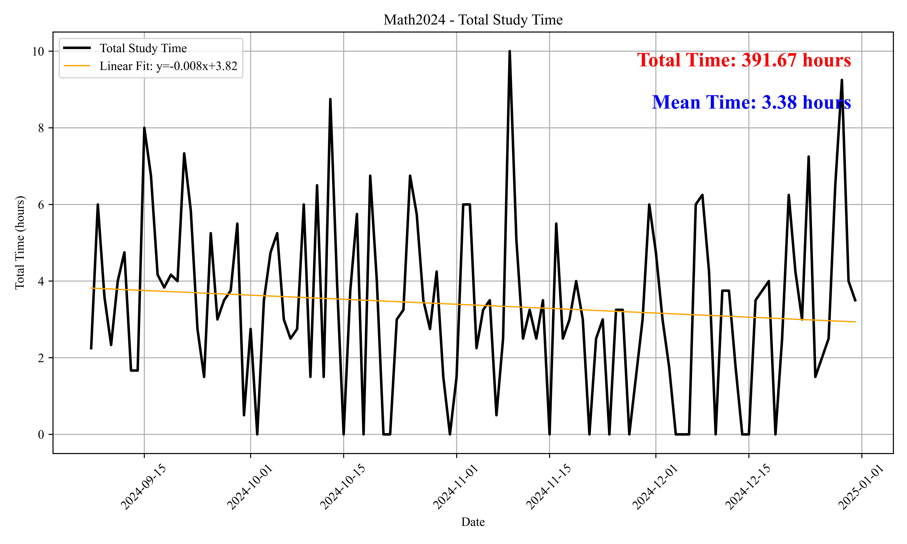
    <div>2024年 391.67h</div>
  </div>
  <div style="text-align: center; flex: 1 1 300px; min-width: 250px;">
    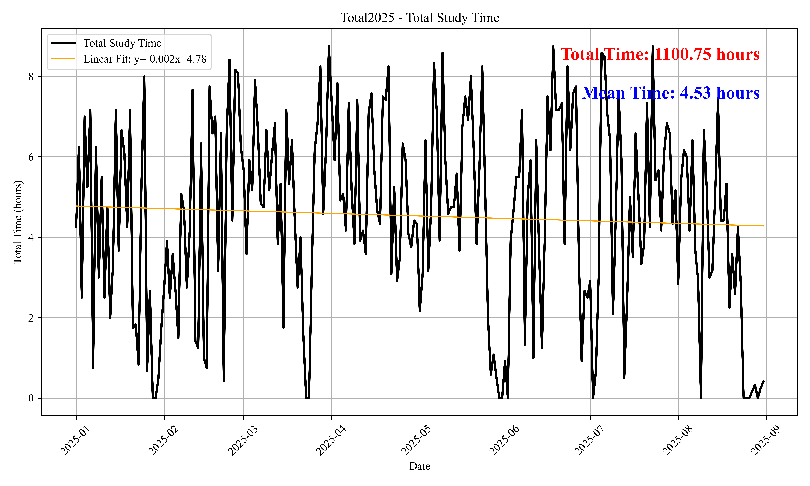
    <div>2025年 1100.75h</div>
  </div>
</div>

不要问我为什么回归曲线都是下降，后劲不足是这样的。其实是因为后面写卷子很多，而做卷子不纳入时间统计里面，后面基本一天一张数学，408和英语分别也是一周两张，每天处理这些的时间一般超过了4个小时。
总共学习时间至少有：
$$
\text{[揍题]} 391.67 + 1100.75*1.5 + \text{[试卷]} (\mathrm{math})210.58 + (\mathrm{408})43.12 + (\mathrm{英语}) 48.53 + (\mathrm{政治}) 8.58 + \text{[背单词]}254.17 \approx 2608 \mathrm{h}
$$
其中不包括看网课、刷政治小程序以及其余不便于统计时间的时长。

统计时长单纯只是为了保证自己不要贪玩而使得学习的时间越来越少，在后期**养成习惯**之后我感觉是不用记了的。（为什么我不用番茄钟什么的呢？因为我喜欢完全的自定义，所以自己写代码统计，当然可能多花一些时间）

然后每日规划的话，备考前期是all in 数学，大三下开始上午408，下午和晚上是英语+数学，暑假以及之后是上午数学，下午晚上英语+408。一般而言，上午是8:30\~11:15，时间比较固定，下午是14:00(15:00)\~17:15，晚上是18:00\~21:00(20:30)，括号代表的是想休息的时候，有时候很累的话晚上都直接回去不学了。我不会规定哪几天休息，只要累了就休息。


<div style="display: flex; flex-direction: row; justify-content: center; align-items: flex-start; gap: 20px; flex-wrap: wrap;">
  <div style="text-align: center; flex: 1; min-width: 0;">
    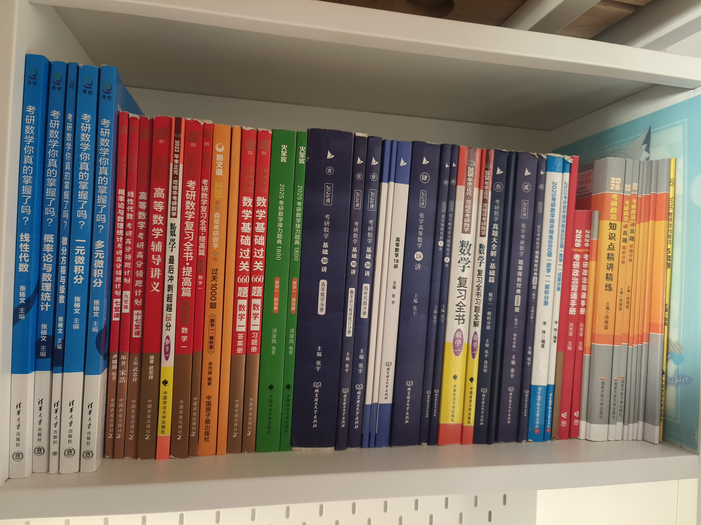
    <div>数学+政治所用书籍</div>
  </div>
  <div style="text-align: center; flex: 1; min-width: 0;">
    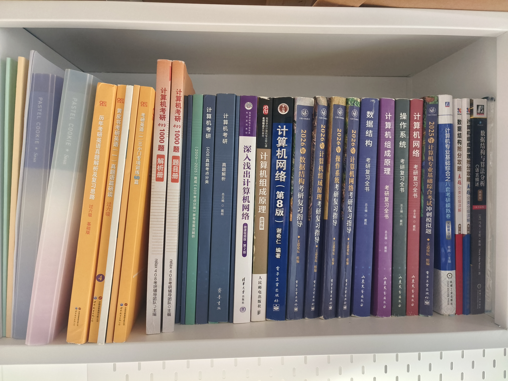
    <div>英语+408所用书籍</div>
  </div>
  <div style="text-align: center; flex: 1; min-width: 0;">
    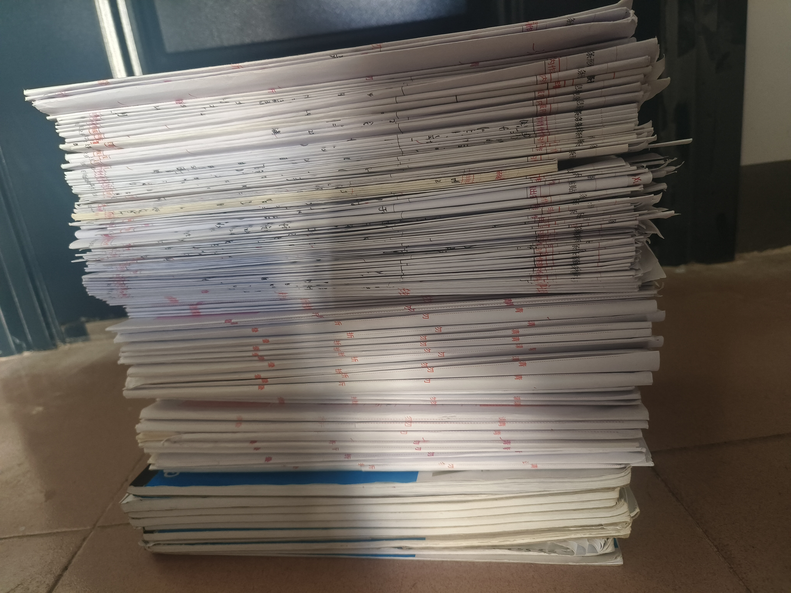
    <div>写过的试卷和草稿纸</div>
  </div>
</div>

### 状态保持
我被最多的问题应该是：**小满考研的时候是怎么保持状态的**，所以这里重点说明一下。
可能很多人以为我状态一直很好，但其实并不是的，在后期我也没有很好的状态了，我只是不想和同样考研的朋友倾诉免得将不好的情绪扩散开来（直到我认识的人的复试全部结束了我才发泄一下情绪）。请记住：“**我所面对的难题也有人遇到过**”，所以不必认为自己不如他人，无论是具体的成绩还是内心的状态。
有记录的是在2025/8月底、2025/11/28、2025/12/14炸了三次，还有更多日常的烦躁，只能说越到后面会越焦虑，越焦虑状态越差，越状态不好越学不进去正确率也低，然后就更焦虑了，形成了一个恶性循环。当时的解决方法是和我最好的朋友聊了聊（并且他不考研）❤️“考前是这样的 容易紧张这个紧张那个 只要不后悔自己的选择就行”，“**没事 慢慢往上爬 走一步看一步**”。考上并不需要做到完美，尽了自己的力量，会有一个好的结果的。现在事后来复盘的话，我认为是需要接纳自己的情绪，接纳自己的不完美。我把这些紧张辛酸卑微的时刻记录下来，是想让有类似经历的人知道：你此刻正在经历的煎熬，也有人曾切身体会过；你觉得走不下去的路，也有人跌跌撞撞地走完过。一定要相信自己！
另外，可以看一下致谢里的内容，我想这次成功是离不开我的朋友们的陪伴的。
🎵 然后，这个歌词出自`【蔚蓝档案】温柔的回忆 中文版`[BV1s7k1Y7E5S](https://www.bilibili.com/video/BV1s7k1Y7E5S)：
> 温柔拥抱困难 回忆珍藏陪伴
从现在直到永远
即便身处黑暗 也有心中蔚蓝
散发无尽温暖
只要有你同行 一切恐惧 都会随风消散
向着下一个开头 带着所有的守候
往前走

对于我个人而言，蔚蓝档案给予我很多的力量，让我相信会有奇迹的发生，最终确实也成功了。希望大家也能在备考期间找到属于自己的力量源泉，不必慌，不必急，事物的发展是**波浪式前进、螺旋式上升**的，接纳自己的每一种情绪，照顾好自己，带着心里的那份 “蔚蓝”，一步一步往前走就好✨

然后再补充一点，如果身体出现问题一定不要逼自己还学那么久，一定要调整好身体的状态💊某月我直接寄了两次导致一个多星期废掉了，健康远比考研重要。

### 择校
首先因为个人原因，好朋友都在北京，那么我肯定优先甚至是几乎只考虑北京的学校。
然后筛选出可以考的学校，显然如果是往上考的话，几乎只有人大高瓴、清北这三个选择了。
接着分析自己的优劣势，显然我复试一般，机试依托，初试还是有希望比较好的，那么清华基本是去不了的。
另外，人大高瓴每年个位数招生我可不敢冲，虽然很想去人大，但最后还是选择了池子大的软微。毕竟一战上岸才是最终目标。

### 考后复盘
考后复盘见B站文章: [https://www.bilibili.com/read/cv44354668](https://www.bilibili.com/read/cv44354668)


## 经验分享

### 总述
这里大致说一下我认为最重要的东西，后面再逐个进行展开说明。
0. 首先，本部分按照学科重要性排序，我个人认为数学：408：英语：政治的时间应该为$4:3:1.8:1.2$，前期可以更多一点学数学，后面可以多分英语政治一点时间。大后期（10月）再开始政治理论上也不迟但是压力可能会很大，一定要相信肖四。
1. 无论如何一定要在数学上面多花时间，以及我本次数学分数很低，后面我主要说一些教训吧。
2. 408从26的卷子来看我觉得还是要回归一些课本的，数据通路图只在上课阶段学习过，虽然当时肯定基本弄懂了但是忘得差不多了，考场上花了很多时间读图也没做对多少。
3. 英语的话一句话总结就是单词+AI，首先保证阅读至少80%看得懂，然后一定要复盘做错了的真题，这个和作文都用AI就行了，一对一讲的很清楚。
4. 政治还是老套路，跟紧肖秀荣包拿平均分的。


### 数学

#### 总述

考前信心满满要写数学的经验贴的，结果考成这个鬼样子只能写教训贴了属于是。
主包考研期间数学试卷均分**136.21**（选填大题依次扣3.2,3.7,6.8，高数线代概率依次扣8.9,2.6,2.3）。高考数学110（2022年新I），即使不考虑22年的卷子问题，平时的也大致是在105~145之间浮动，std很大。所以一定要重视自己的问题，我从自招到高考到考研三次大考的数学都没有发挥好，第一次是确实知识点掌握的不够（初中那会儿教育资源一般外加自己也比较摆），第二次是失误错了十分以及难题确实一个都没写出来。那么我就应该反思自己的问题，在考之前我觉得是**粗心+难题不会**，因此备考期间基本都是刷经典题和难题（李正元、李艳芳铁粉属于是）。
考试的时候我知道卷子很简单所以写的很慢（大概是争取过程写好然后不要算错什么的），2个小时才写完，知道自己T3，T22(1)做的有问题（T22甚至算出来概率密度存在负值），但从过去的经验来看我先全盘检查，花了半个小时吧然后发现没错的（当时有点难蚌，感觉时间浪费掉了，不过我不希望赌到底有没有错，我希望期望值更高吧）。后面就做这两个不会写的，但是毕竟时间没多少了当时挺紧张的。
T3当时检查的时候举出来了反例然后自我否定了认为需要连续（但其实并不需要），所以直接过了（盲目自信以为没问题，没有去严谨证明），因此如果可以重来，那在读题的时候一定要标注考点，不连续已经出了几次了，我最初读这题的时候也记得，但是检查的时候就已经忘记了。
T21是题意理解的问题，我当做了$C_n^1$的零件损坏，但应该是$\min{x_1,...,x_n}$的零件损坏，以及指数分布的min有可加性还是我笔记本专门列出来的结论，没读懂题这块。所以最后求来求去也是错的。
不过换句话说，至少数学这次没有让我拉开很大的分差，至少我对这个分数没有意见。
然后是之前ds给我说的一句话：`状态波动时，计算失误会优先攻击你的薄弱章节（积分/曲面）`。我觉得仍然正确，概念题和概率分布我确实掌握的也不好，只是平时没有怎么暴露出来。

如果说能倒退一年，我会选择少做题多复盘多做近年的模拟卷，以及合理安排任务量，具体见下文高数、线代、概率各板块的详细分析。

整体评价：
1. 书: 李正元 $ > $ 张宇 $\ge $ 武忠祥
2. 题: **真题** $\ge $ 李艳芳 $ > $ (李擂) $ > $ 李林 $ \approx  $ 张宇。李擂打个括号的原因是难度确实有点太高了，到底值不值得写需要打个问号。张宇这个我也不是很好评价，质量的浮动很大，以及没用的东西挺多的，一般而言目前是推荐25基础+26强化这样的，不要碰25的强化，真的，浪费我一个月。

真题解析的话无脑买李艳芳解析，相当细致到位。

总结一下我的失误：
1. 简单的年份不失误只能保下限，考场上稳住**心态**很重要。
2. 模拟卷数量与最终结果没有关系，很难想象我是做了106套真题+模拟卷的吧，我真不是模拟哥啊😭（至少不会错的打√）。我觉得有些卷子确实需要**二刷**..二刷的不应该只有习题集。


<div style="display:flex; justify-content:center;">
  <div style="text-align:center;">
    
    <div>数学备考全流程</div>
  </div>
</div>

<div style="display:flex; justify-content:center;">
  <div style="text-align:center;">
    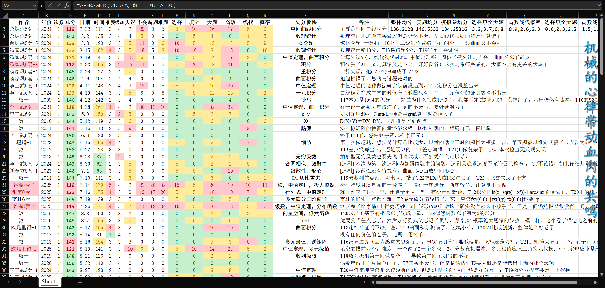
    <div>数学试卷（部分），完整的可以在我github里的kaoyan仓库找到</div>
  </div>
</div>

#### 高数
高数整体知识点多难度较大，尤其是数一，从我个人角度而言，除去本来就应该写很多的经典题，多做那种**概念创新题**会比死扣细节和小巧思要好，我直接点名张宇的基础30讲附录的几百个积分，我是没做的，也没看真题出过很难的积分题。本人因为当时用的25的张宇强化，算是吃了个大的，然后对张宇的卷子没什么兴趣（事实证明我又错了，张四还是应该做的，从近三年的反馈来看）。
然后高数比较好的我觉得是李正元的复习全书，最强的地方在于**总结**的非常详细，而且是平时很多地方几乎不怎么提的内容，比如极限为无穷算不算极限存在，以及曲线曲面积分中的对称性（“偶零奇倍”的那个情况）都进行了证明与总结。整体的思维链是非常强的，但也注定了李正元的书只能慢慢读，自己读。我个人是不喜欢看课的（信息密度低、容易走神、容易切出去刷其他视频...），所以我很喜欢啃李正元。反之如果喜欢看课的话，一般大众的选择就是武忠祥张宇了吧（红蓝大战），我的身边经验学是蓝的更多。

#### 线代
从我个人的角度来看，因为学机器学习的时候矩阵学了很多，然后又有**实际应用**的理解，类似于20·数一T6、秩、矩阵分解等这方面的内容就迎刃而解，据说看3Blue1Brown的线代视频也有类似的效果，可能可以尝试一下。
从传统的学习角度来看可以选择李正元，整体的**结构**很清晰，结论是环环相扣的。
PS.如果认为$m\times n$很容易将$m,n$记反或者模糊，可以将矩阵的shape写为$n\times D$，其中$n$是样本数，$D$是特征数，这一点学过机器学习的人会比较熟悉，然后大小写区分也很明显，坏处是正经的数学资料不会这么写，仅供参考。当然我的笔记是统一写成$n\times D$的。（本思路来自《鸢尾花书》，本书虽好，但不推荐为了考研而看，性价比低）

#### 概率
都说余炳森的好，但我也没看，因为往年的概率论都不难（哪怕是25也是很常见的题型），不过我可能忽视了考场发挥的问题，不能因为以前的简单就应该松懈，25的我第一次写也写了很久的，我觉得数学还是需要做到看到就可以下意识知道怎么做的，就像1+1=2无论何时都会做一样。


### 408

408的话我本科成绩是数据结构89、操作系统94、计算机组成原理79、计算机网络94，属于开摆人士。备考期间真题+模拟卷平均**132.05**分，模拟卷只完整写了5套然后剩下的只写选择+部分大题。
书：**竟成** $\approx$ **王道** $>>>$ 其他。除了经典的王道竟成，我还买了启航、中公的，但是真的没什么用。我觉得第一遍刷王道知道有什么知识点、考什么就行了，第二遍再用竟成对真题没考过的细节进行补充。王道是每年更新去年考过的东西的，所以看似学了王道往年题做的会很好，实际上年年有新的。这就真是“真题从未考过，务必重视”了，不过肯定务必优先把考过的全部弄懂。然后题目的话做课后的题就行了，学有余力可以尝试relax1000题（有开源的，但是纸质版购买也不贵；纯选择题，质量较高，但是新出的，没有什么校对存在一些笔误等）
PS.课本没列上去是因为考研期间我基本没用过（因为平时学了），然后本科有些是自编教材，我觉得需要看教材，不过不好在上面排序就是了，并不是说教材不重要。
课程：计网**湖科大**，其他的王道（计组也可以湖科大我感觉）。一般睡觉前看不会的部分。然后湖科大出了计网的408考研直通车的书，不过我之前买了他的深入浅出计算机网络（第2版），看了一下内容应该差不了很多就没买，我觉得后面买408考研直通车就行了，湖科大的计网还是太权威了。
模拟卷: **relax** $\approx$ 竟成 > 王道。relax是开源的不知道是不是第一年出反正我没找到以前的，竟成每年好像更新一套卷子其余的不变，王道是每年换一点点题目变化不大。
我印象里是relax出了个和这次题目数据通路比较像的图（应该是教材上有的，我已经忘掉了），应该是王道压到了无限循环浮点数的就近舍入让我白捡2分虽然我还是不会。竟成是卷子整体出的比较好（王道的大题一般，relax计网大题每次都偏简单），但是你要说压到这次的啥了吗好像又没有。

真题用竟成的就行，王道的解析不是很好。

然后408用AI的话要注意可能会“出错”，嗯，所以以真题为准。

<div style="display:flex; justify-content:center;">
  <div style="text-align:center;">
    
    <div>408备考全流程</div>
  </div>
</div>
<div style="display:flex; justify-content:center;">
  <div style="text-align:center;">
    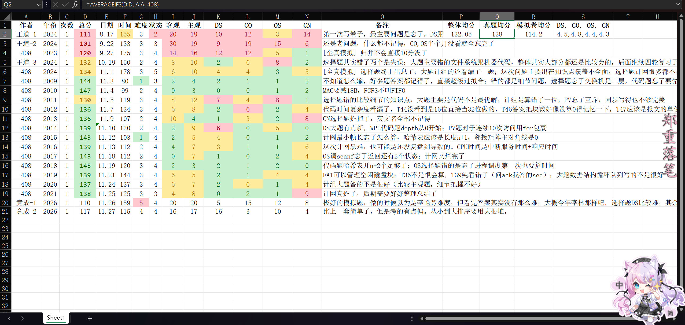
    <div>408试卷</div>
  </div>
</div>


### 英语

#### 总述

主包考研期间英一均分**76.2**，高中英语基础尚可（高考134，不过没这么发挥好，当时听力前5个错4好像是），完型与作文是优势项目，阅读推理题、听力、单词量是劣势，但大学几乎没有主动学过英语。在考研复习之前考的六级433，在复习半个学期之后六级563，最后26考研客观题-0.5(第8题错了)，总分93，应该算是很满意的成绩了。

英语整体备考流程为:

<div style="display:flex; justify-content:center;">
  <div style="text-align:center;">
    
    <div>英语备考全流程</div>
  </div>
</div>
<div style="display:flex; justify-content:center;">
  <div style="text-align:center;">
    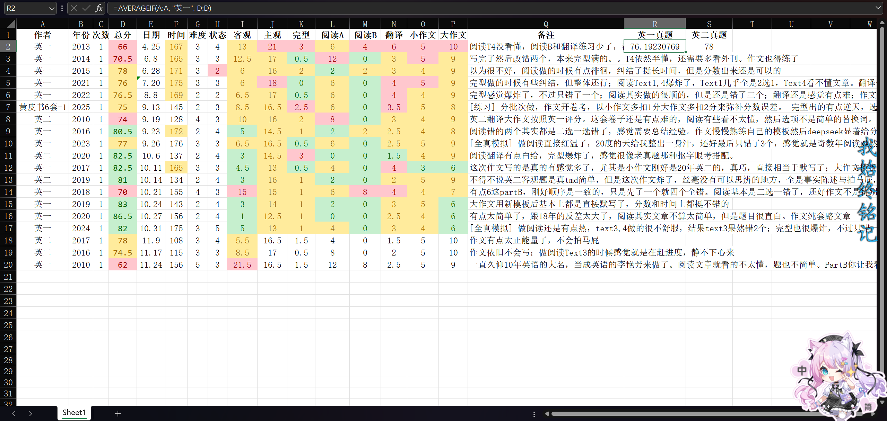
    <div>英语试卷</div>
  </div>
</div>

真题用黄皮书的就行，解析非常好，有些本来感觉争议的看了答案豁然开朗，以及黄皮书的作文可以直接当范文背，缺点是贵而且厚（一张卷子有四十面解析+四十面精读+十面总结）。

#### 单词
最重要的是**单词的持续输入**，笔者使用的是“不背单词”软件，该软件最大的优势是UI简洁且几乎免费(大约半年即可换取VIP)且让大家意识到高利贷的后果(指: 只要几天没复习后面就会越滚越多)，虽然5.22就背完了红宝书，但是11.5才完成恋恋有词，因为恋恋有词有差不多2k个超纲词，还是很难背的。我推荐的背诵顺序是:
1. 红宝书**非超纲词**(超纲词约1k个，其实并不怎么超纲)，两三个月就能完成。
2. 配套的**词组**(不背单词的挺好的，其他app不知道有没有)，词组中的单词基本都是已经学过的，只是用法不熟悉，因此一般两个星期可以完成。这个我觉得还是很重要的，看多了之后完型蒙对的概率都大很多，而且阅读有时候也需要，作文也可以择机选择部分。
3. 红宝书的**超纲词**(如果要考六级此时也可以适当背一下六级单词)，可能需要一个多月。
4. 依据自身需求选择**复盘**红宝书还是多背一本恋恋有词(注：笔者自己是在背恋恋有词前选择重学所有非标熟词，好处是巩固的很牢，坏处是要花很多时间，而且部分词已经很熟悉了没有必要复习；如果能重来我会选择重学非标熟+复习完成的词，只复习复习中的，复习完成的其实只有极少数的忘了，性价比太低)，该阶段一直持续到考前即可，有时间就滚动复习。
5. 超纲词请适可而止，我个人觉得我背恋恋有词的性价比不算特别高，尤其是一些专有名词当初就应该直接skip掉，浪费时间了。

PS: 主包从24.8.31到考前25.12.19除了24国庆断过一天外**全勤**打卡，一般一天单词复习100\~300个，新输入50\~0个，每天大概三四十分钟，最痛苦的阶段是最开始和最后面。最开始都是新词或者高中背过但已经忘了的，需要花很多时间去适应。中期相对比较轻松，因为是复习+学词组，外加做阅读的时候已经语境学到了很多词(语境学习记得最牢，务必重视)。最后面是因为复盘每天有两三百个(最多的那段时间每天400+搞得我要崩溃了都)，外加还有新词要认，很烦的说。

<div style="display:flex; justify-content:center;">
  <div style="text-align:center;">
    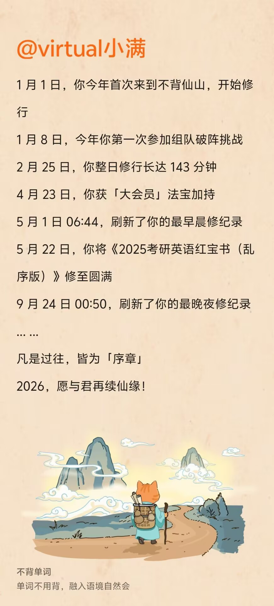
    <div>不背单词年度总结</div>
  </div>
    <div style="text-align:center;">
    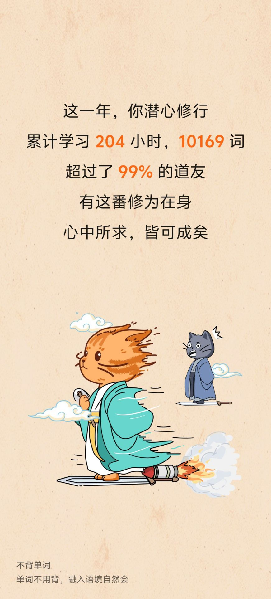
    <div>我自己也没意识到一年背了这么多</div>
  </div>
    <div style="text-align:center;">
    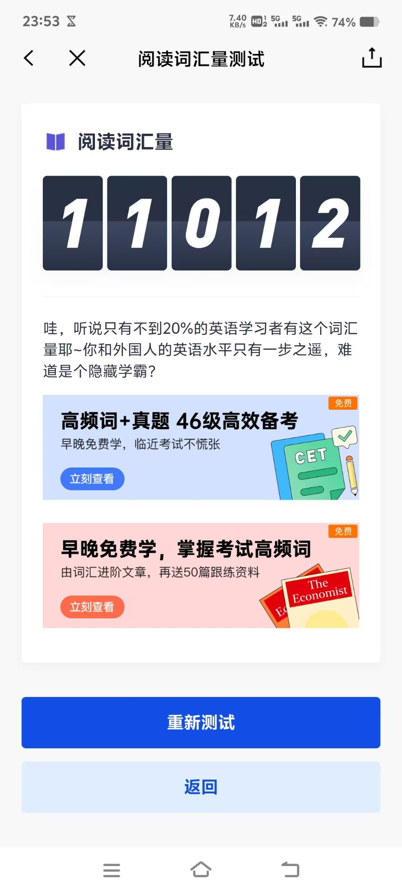
    <div>从最初5k到后面慢慢稳定1w+</div>
  </div>
</div>

#### 阅读&完型&Part B&翻译
阅读最佳材料无疑是真题，但显然**英一真题完全不够刷**，一般而言推荐近年的，我觉得**12~26**的会比较适合练习(笔者完整做了10~25的真题，选做了10以前的部分真题)，即使刷完也只有15套，哪怕4天一套60天也做完了，或者是2个月，即使算上做部分近年的英二，肯定也是不够完整的备考周期的，因此做模拟题是必然选择。

笔者推荐的模拟题是: **黄皮书 $\ge$ 新东方(红皮) $>$ 华研**。在“英语备考全流程”一图中已经展示了我完成的资料。
1. 新东方的一定不要买错，选择**红皮**的基础100篇(强化的我没做不知道怎么样，但应该是差不多的)，不要选择绿皮的报刊阅读，虽然绿皮的文章很纯正，但是题目非常非常烂，完全没有练习价值。100篇不一定要刷完，可以每个话题刷一部分到自己熟悉了如何做题即可。我刷完了基础100篇，强化刷不动了。
2. 黄皮书我当时没找到阅读，买的三小门(完型+Part B+翻译)，题目质量较高，同时难度也很大，很适合作为第二本练习。后面笔者发现其实黄皮书的单本就是它模拟卷上的题，所以可以直接买它的模拟卷的，更便宜。
3. 华研基础其实就是早年真题(10年之前)，它的解析写的还可以，可以自行考虑是否练习。其余单本笔者认为中规中矩，优先做上面的。PS.当然也可以就用黄皮书，毕竟黄皮书的解析是我见过的最好的。

注意，练习模拟题的主要目的是**看懂文章、寻找手感**，学习部分出题思路(模拟题不必细究，可能本身不严谨，想不通的=你对)；真题无论是否认同，都必须接受老头的想法(尤其要琢磨近年的真题考法)，想不通的=老头对。

#### 作文
PS.首先说一下，我在看经验贴或者问学长的时候给到的答复都是主观题不要花很多时间，因为拉不开分差，不过后面我想了一下，因为我当时数学408的均分基本稳定在260+了，感觉提升很难，所以只能靠政治英语拉点分作为防止数学408有哪门爆炸了，自然政治我是考不高的，那么我想发挥我英语作文的优势，事实证明有一些主见可能是好事，这次作文我觉得加起来最多扣6分吧（因为我翻译有一个不会，加上完形填空应该至少扣掉了一分）。

作文的话我觉得尽量有一套自己的模板，方便**背诵与复用以及持续优化**，比如我的大作文模板是(请不要直接填空本模板，是图画+图表&国家+个人的缝合，实际使用必须结合题目侧重点，根据实际情况来侧重国家或者个人):
　　**The thought-provoking picture vividly depicts a scenario that** ... . Supplementing this vibrant scene, the bar chart vividly showcases a substantial surge in the number of ..., escalating dramatically from $N_1$ in $t_1$ to an impressive $N_2$ in $t_2$.
　　The implications inherent in this phenomenon are **far-reaching** and uplifting, reminding us to keep up the momentum and strive for the great rejuvenation of the Chinese nation. At its core, this scenario serves as a compelling reminder of the necessity of ..., inspiring us to stay committed to our goals. A ... disposition **renders** them incapable of recognizing opportunities in challenges, **leaving aspirations unfulfilled and potential untapped**. ... serves to open up long-lasting opportunities for students and to enhance their potential for meaningful advancement, **thereby reinforcing the solid foundations upon which long-term progress or transformation rests**. The exemplary figure portrayed in the image exerts a profound and sustained influence that markedly cultivates intrinsic motivation among students.
　　**To build upon this promising trend and sustain this momentum, concerted efforts at all levels are imperative.** The government should establish **forward-looking** policies and ensure their effective implementation. Meanwhile, the media and social institutions ought to take the lead in enhancing public awareness and cultivating a sound social environment. Above all, every citizen must **transform awareness into concrete practice**, for lasting progress **takes root not in slogans**, but in the actions of ordinary people.
具体的模板与使用方法可以参考我的英语作文笔记（链接见附录）。下面给出一些使用的示范：

<div style="display: flex; flex-direction: row; justify-content: center; align-items: flex-start; gap: 20px; flex-wrap: wrap;">
  <div style="text-align: center; flex: 1; min-width: 0;">
    
    <div>考前的下午写的模板，应该适合大部分大作文</div>
  </div>
  <div style="text-align: center; flex: 1; min-width: 0;">
    
    <div>2024年小作文</div>
  </div>
  <div style="text-align: center; flex: 1; min-width: 0;">
    
    <div>2024年大作文</div>
  </div>
</div>
注意：2024年的两套文章为模拟考试所写，不代表没有错误，如需范文请参考我的作文笔记。这里仅作一种模拟实际考场下平衡速度与质量的示例，仅供参考。

#### 答题卡

这里给一张真正的英语答题卡的图，供参考：

<div style="display:flex; justify-content:center;">
  <div style="text-align:center;">
    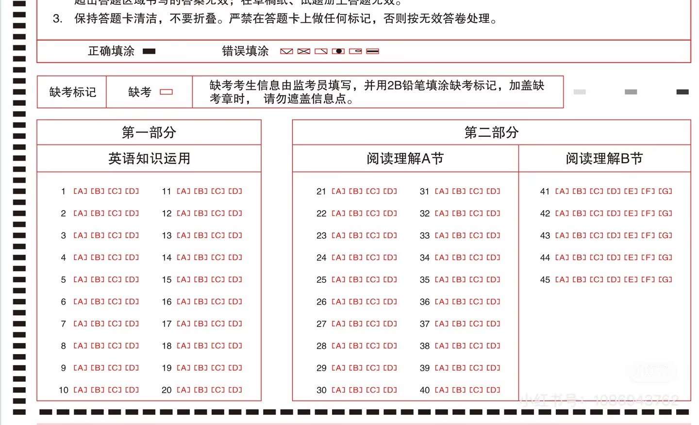
    <div>其他科目的答题卡也是类似的。其实涂的宽度很窄，不像平时网上可以买到的主流答题卡那样很宽，因此填涂速度能比平时快很多。</div>
  </div>
</div>

#### 学会使用AI
英语是最方便使用AI的科目了。对于客观题可以用AI翻译全文以及分析选项，主观题可以用AI来写作文。我只能说在学英语的过程中AI的作用是最大的。个人推荐的是ChatGPT>Gemini>DeepSeek，显然国外的AI的英文能力肯定比国内的好。
提示词如下：
1. 小作文批改：
```
假如你是一名批改考研英语一小作文的阅卷老师，请根据以下评分细则和题目要求对考生的作文进行打分，并回答0-10区间的分数情况、打分依据和修改建议（需要给出修改优化后的文章，使得在保证不过度修改考生本意的情况下修复单词语法错误与逻辑问题，并尽量使用优美专业的词汇，但不能为了使用高级词汇而堆砌词藻或是使用极其生僻的词语）。
评分细则如下：
现根据文章内容和语言确定所属档次，共六档：
1. 9-10分：内容切题，包括提纲的全部要点；表达清楚，文字连贯；句式有变化，句子结构和用词正确。文章长度符合要求。
2. 7-8分：内容切题，包括提纲的全部要点；表达比较清楚，文字基本连贯；句式有一定变化，句子结构和用词无重大错误。文章长度符合要求。
3. 5-6分：内容切题，基本包括提纲的要点；表达基本清楚；句子结构和用词有少量错误。文章长度符合要求。
4. 3-4分：内容基本切题，基本包括提纲的要点；语句可以理解，但有较多的句子结构和用词错误。文章长度基本符合要求。
5. 1-2分：基本按题写作，但只有少数句子可以理解。
6. 零分档：所传达的信息或所使用的语言太少，内容与要求无关或无法辨认。
字数若少于70词则需要酌情扣1~2分。
输出格式要求：分为"原文" "原文(带注释，注释说明单词语法等错误)+段落、文章整体的结构逻辑等问题" 和 "范文" 三部分。
```
2. 大作文批改：
```
假如你是一名批改考研英语一（大作文的阅卷老师，请根据以下评分细则和题目要求对考生的作文进行打分，并回答0-20区间的分数情况、打分依据和修改建议。（需要给出修改优化后的文章，使得在保证不过度修改考生本意的情况下修复单词语法错误与逻辑问题，并尽量使用优美专业的词汇，但不能为了使用高级词汇而堆砌词藻或是使用极其生僻的词语）。
评分细则如下：
现根据文章内容和语言确定所属档次，共六档:
1.17-20分：写作内容紧扣题目，论点明确、论据充分；行文逻辑清晰、论证严谨，灵活运用各种衔接手段；熟练使用复杂的语法结构和高级词汇，语言表达自然流畅，极少出现语法错误；格式与语域恰当贴切。
2.13-16分：写作内容紧扣题目，论点明确，论据较为充分但有时会缺乏重点；行文连贯、逻辑严密，采用了有效的衔接手段；综合使用简单句式与复杂句式，语言表达基本准确，只有在试图使用复杂结构或者高级词汇时才有个别语法错误；格式与语域较恰当。
3.9-12分：写作内容基本扣题，论点明确，但某些分论点未能充分展开论证或不够合理；采用了一些简单的衔接手段，但有时出现不准确或重复使用；语言表达以简单句式和基础词汇为主，有一些语法及词汇方面的错误，但不影响理解；格式与语域基本合理。
4.5-8分：论点不够明确，有时缺乏结论，大多时候未能针对论点展开论证，且这些论点可能重复或者出现无关细节；行文不够清晰，采用了非常有限的衔接手段，且有时未能体现前后句子之间的逻辑性；只会使用基础词汇，仅能使用较为有限的语法结构，只能偶尔使用从句，有较多语法及词汇方面的错误，这些错误可能会造成文章理解困难；格式与语域不恰当。
5.1-4分：基本按题写作，但只有少数句子可以理解。
6.零分档：所传达的信息或所使用的语言太少，内容与要求无关或无法辨认。
字数若少于90词则需要酌情扣1~2分。
输出格式要求：分为"原文" "原文(带注释，注释说明单词语法等错误)+段落、文章整体的结构逻辑等问题" 和 "范文" 三部分。
```
从我最后考试的结果来看，似乎AI的给分比这次北京阅卷的给分还低一些，平时我AI主观题（翻译+作文）会扣十几分，这次应该扣的6.5分左右。
一般情况下我先自己写一遍作文保证自己至少有东西能写出来，然后把我想说但是写不出来英文的使用中文描述出来丢给有道翻译，然后进行作文优化，尽量写出自己的模板来。当然我的模板目前显然证明是可行的，不过有多少人会用我就不知道了，反正我当时只在我自己的小群里发过我的模板，基本是100%原创（不考虑AI）。

**然后如果需要我讲一下作文怎么写的话，我再单开一个专栏吧**，比如说我总共有6个AI提示词全写这里的话篇幅真的有点太大了，然后还有我的作文笔记我还是很满意的，虽然笔记里面有些是废话。


### 政治
这个我没啥说的感觉，我一正常分数（66），老老实实跟着大流走的。就说一下备考流程：

<div style="display:flex; justify-content:center;">
  <div style="text-align:center;">
    
    <div>政治备考全流程</div>
  </div>
</div>

1. 暑假\~9月：**肖秀荣精讲精练+徐涛网课**，如上文所述我不喜欢看课，徐涛的马原我都没看完，大概三倍速看了十几个小时的就看不下去了（ps.我也没觉得看了对我这次考试有啥用），肖秀荣的精讲精练还行，毕竟我是完全0基础（初中走的自招不需要政治分数，高考也没选政治），需要知道政治要学啥。
2. 10月：**肖秀荣讲真题+1000题+背诵手册**。讲真题我觉得非常好，我不知道哪些人在那说政治真题不重要，首先真题重复率（原题复现）非常高，不做你干瞪眼吗（当然这次没有真题复现的说，只有类似考法的），其次是要熟悉老头的风格，练下感觉。然后讲真题的答案重要性远大于做题本身，答案的思路是需要学习的，然后后面附赠的套卷可以看一下大题是怎么写的答案。1000题我是小程序（苍盾）刷的，每天几十道很快也刷完了，依然是熟悉做题的感觉，马原部分我基本背完了+结合讲真题总结规律，后面就是有印象但没着重背也没怎么整理。背诵手册说实话我没怎么用，我根本什么也没背，翻的也不是很多，就看了点表格什么的。PS.苍盾在我那年改了收费内容，收费的多了很多，吃相有点难看，但小程序除了方便还有一点就是看别人的笔记，他差不多是垄断地位的那我也没招了。那时候听说南山挺不错的但我已经充了苍盾了就没换了。
3. 11月\~12月：**肖四肖八**，今年出版的巨晚，甚至那时候因为政治没事做都买了去年的肖四肖八看着玩。这次选择题没那么多压到的，大题还是挺强的，结合B站大牙的抄材料，考前背一下肖四，这个成绩反正没拖后腿就是了。PS.肖四我没背完，肖四后面有大纲背诵，我只背了全部的马原，其他的基本是关键词背诵以及一些经典套话，目测大约会比100%背完的少4\~6分吧。政治我还是追求性价比的。


### 软微
以下成绩信息为官方文件的自动统计，含集成与金科。如需仅408方向（方向1~4）数据，可查阅M佬的文章。
**软微历年初试分数：**
```python
2026:
         政治   英语    数学    408     总成绩
mean    63.66  75.27  137.09  120.42  396.45
median  64.00  76.00  138.00  121.00  395.00
75%     67.00  80.00  144.00  126.00  405.00
min     55.00  55.00  111.00   96.00  378.00
max     78.00  93.00  150.00  140.00  435.00
std      4.27   6.46    8.49    8.28   12.88
2025:
         政治   英语    数学    408     总成绩
mean    61.41  66.25  129.46  118.04  375.17
median  61.00  66.00  130.00  118.00  372.00
75%     64.00  71.00  136.00  124.00  385.00
min     50.00  50.00   99.00   90.00  350.00
max     72.00  83.00  146.00  146.00  424.00
std      4.20   6.93    8.62    9.67   15.36
2024:
         政治   英语    数学    408    总成绩
mean    69.54  77.81  121.55  126.00  394.9
median  70.00  78.00  122.00  126.00  393.0
75%     73.00  82.00  130.00  132.00  405.0
min     55.00  58.00   91.00  102.00  360.0
max     82.00  91.00  150.00  146.00  439.0
std      4.92   5.43   12.26    8.63   15.8
```

<div style="display: flex; flex-direction: row; justify-content: center; align-items: flex-start; gap: 20px; flex-wrap: wrap;">
  <div style="text-align: center; flex: 1; min-width: 0;">
    
    <div>2026初试成绩相关性矩阵</div>
  </div>
  <div style="text-align: center; flex: 1; min-width: 0;">
    
    <div>2025初试成绩相关性矩阵</div>
  </div>
  <div style="text-align: center; flex: 1; min-width: 0;">
    
    <div>2024初试成绩相关性矩阵</div>
  </div>
</div>
值得注意的是408的重要性开始慢慢高于数学，建议可以花更多时间去准备专业课。


**软微历年录取分数：**
```c
2026：
          mean    median    75%    min    max    std
初试成绩  398.79  398.00  407.00  378.0  435.0  12.69
复试成绩   85.62   85.60   87.80   77.4   93.8   3.15
总成绩    82.11   81.76   83.41   77.0   89.0   2.08
2025：
          mean    median    75%     min     max    std
初试成绩  378.06   376.0  389.00  350.00  424.00  15.26
复试成绩   85.42    85.2   87.40   77.60   93.80   2.91
总成绩    79.54    79.2   81.04   74.48   85.52   2.31
2024:
          mean    median    75%     min     max    std
初试成绩  397.35  396.00  407.00  360.00  439.00  15.86
复试成绩   85.37   85.50   87.40   68.60   93.80   3.34
总成绩    81.83   81.72   83.21   72.88   88.16   2.52
```
<div style="display: flex; flex-direction: row; justify-content: center; align-items: flex-start; gap: 20px; flex-wrap: wrap;">
  <div style="text-align: center; flex: 1; min-width: 0;">
    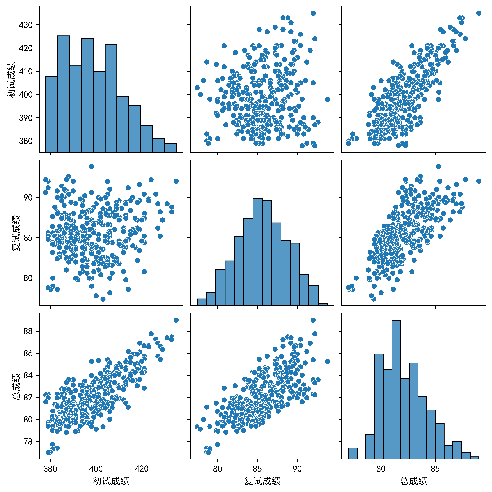
    <div>2026录取成绩散点图</div>
  </div>
  <div style="text-align: center; flex: 1; min-width: 0;">
    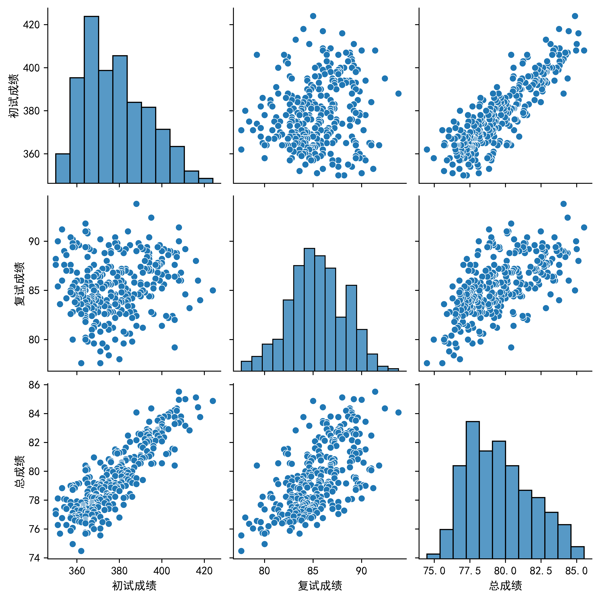
    <div>2025录取成绩散点图</div>
  </div>
  <div style="text-align: center; flex: 1; min-width: 0;">
    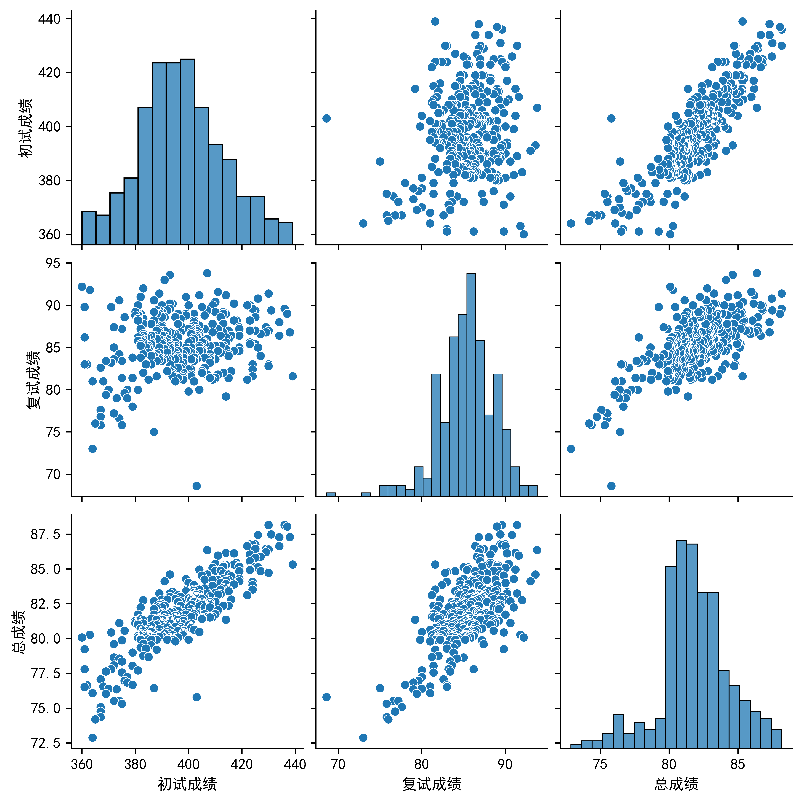
    <div>2024录取成绩散点图</div>
  </div>
</div>

值得注意的两个现象，一个是显然总成绩与初试成绩更加正相关。一个是高分的复试一般不会很低（可以看第二行第一列的子图的右下角，基本没有什么点）。


## 复试
26.3.16大约16-17点出的通知，资格复审材料请于3月19日17:00之前（寄达时间）快递至学院教务办公室，所以建议**提前准备**材料。复试时间为2026年3月25~27日。官方通知如下：
复试线（378）：https://ss.pku.edu.cn/zsxx/zstz/007b614356c247a897f5adbbb6494f3f.htm
复试通知：https://ss.pku.edu.cn/zsxx/zstz/ddd9bc9e4c1c469897f5db3122c19253.htm
复试如何准备请看：https://zhuanlan.zhihu.com/p/26930675365，出于保密协议我也不可能说具体内容的QAQ。


## QA
### 考研最大的收获和最大的遗憾
1. 首先，最大的收获是，我并不认为是一张录取通知书的事情。`感觉高中结束失去的不是知识，而是能沉着下来追寻知识的心_(:з」∠)_`可见于我很早之前（2023/3/2）发的动态：https://www.bilibili.com/opus/768459263979815040。我认为，经过一年多的备考，至少我可以静下心来去做一些事情，而不像刚入大学的时候一有问题就沉迷游戏。其次是内心变得更加强大了，在复试结束之后发生了很不愉快的事情，和高中遇到的挺像的，但是这次很快就走出来了。最后，我觉得我可能会更加相信努力创造奇迹了吧，Where All Miracles Begin。
2. 最大的遗憾是为了考研失去了很多。有些不方便说，但至少是鹿乃可能最后一次在中国的演唱会没去，以及一些朋友的主动邀约也拒了，然后也因为没有什么聊天的时间让很多关系变淡了。遗憾是必然有的，考完后我也尽量去补救了，不过有些可能失去了就是失去了的。

### 如何坚持下来
首先，感谢高中的同学、网友们始终支持着我，我也经常会回顾往昔，从过去中汲取力量，下面都是高中写的：
1. 你是否过着没有自我，盲目追求目标的生活呢？勿将目标当成执念，**把握生活点滴日常**。或许个人太渺小，活不了自己最想要的生活，但尽力了，遗憾就能少一点。 
2. 我们要鞘翅振涌，卷起击碎**俗手**的漩涡，等待数百天伏蛰的**本手**，一瞬冲破黑暗，迎来柳暗花明的**妙手**！ (本句写于2022高考语文作文)
3. **小**小的成功也需要**满**满的努力！

总之，我觉得坚持下来最重要的就是要有一个正确的心态以及清晰的目标和动力，虽然这很难，但是这就是命令。嗯，或许可以多看看生活中的美好，我觉得我的朋友们就是我遇到的最大的美好了。
以及我似乎超额实现当初的目标：
| 数学 | 专业课 | 英语 | 政治 | 总分 |
| ---- | ---- | ---- | ---- | ---- |
| 137 | 130 | 75 | 70 | 412 |

### 假如时光倒流一年，我会如何调整复习
1. 数学首先要注重复盘与理解，首先概率那个是真的没看懂题不然知道是min就秒了，然后选择题那个也提醒我应该时刻标注题目要考的点，而不是做着做着忘记了。
2. 专业课务必回归课本，多看一下那些主干知识但是没考的地方，这次考数据通路，下次是不是考乘除法运算器了。
3. 英语不知道怎么调整了这块（）可能应该多花一点时间在数学和专业课上面。
4. 政治可以少花一点时间去看精讲精练，多做点模拟卷的选择题。
5. 减少焦虑：如果能重来，我首先是不要给自己那么多的负担，任务越堆越多的后果是心态很难平静下来，甚至我觉得刷得多了反而对我起到的是副作用，理论上我暑假除了政治以外都可以上考场了，但是后面还是焦虑到睡不着觉学不进去什么的。毕竟从各种角度来看，我可能有且仅有一战上岸软微这一条路了。（其实感觉现在我也挺焦虑的？总之不要学我这么内耗）另外一个，尽量少看群，一般情况下会加到某些群里面基本只发通知信息和资源什么的，这种可以留着，像有些群里面全是模拟哥的，真可以退了。

### 是否要做笔记
408需要做，数学最好有一点，其余的随意。我所有科目都做了，但是侧重点不一样。数学主要是总结+一些经典题。408主要是知识点归纳梳理，把不同科目或者不同章节的相同考点放在一起（比如计组和OS的内存管理），辅以极少量我觉得很有意义的题目（真题为主）。英语是唯一一门电子笔记，因为复制文章、优化作文什么的用电脑会很方便，主要是作文修改、阅读精读、词组积累什么的。政治基本没做笔记，最开始画了马原的思维导图，感觉意义不大。

### 是否要看网课
看个人。我全程几乎叫做没看网课，我看网课基本只会看我不会的内容。最主要的原因是很容易分心，然后我的眼睛也不支持我长时间看屏幕（所以我也很少使用电子书，即使我几乎都有）。


## 致谢

**首先，必须感谢各位老师，如果没有这么多优质的资源，我想备考的过程会很艰难低效的。**感谢李正元、李艳芳、张宇、武忠祥老师，对数学的原理讲解的很透彻，让我的数学成绩与均分相差不多。感谢王道、竟成、湖科大老师，对知识点繁多的408进行了大量的总结和归纳，最后考的也挺满意的。感谢黄皮书、ChatGPT、DeepSeek、Gemini，对真题的讲解以及作文的优化提出了大量意见，最终让我的英语成绩有了很大的提升。感谢肖秀荣老师，让我用最少的时间换来了不拖后腿的政治成绩。
**其次，必须感谢我的朋友们，如果没有你们的陪伴与支持，我不知道我是否可以坚持到最后。**这里非常非常非常要感谢**RODŽUŠIĆ**、梓欣、火焰岛。初试期间，我几乎每次有情绪问题时，都会找Rod倾诉，而他总是能给我很多的安慰和鼓励，我们一直在并肩作战，“每一个脆弱的瞬间 都有你陪在我身旁 这世界因为有你存在 漆黑的夜中透出了一点点微光”。复试期间，Rod和梓欣也在帮我修改简历和PPT，以及分享经验，最终做出来的我都很满意，复试成绩在没有过多准备的情况下也挺高的了。我永远也忘不了高中时和火焰岛的夜谈，能在高中时期就建立起正确的三观我觉得很及时很有必要，有时候高中的我都能为现在的我解决很多问题。我也很喜欢这半年来和梓欣对于各种问题的探讨，每次聊天都能让我收获很多的启发，很多问题其实并不是只有我有的，以及一些事情的发生并不是我的错（其实我还是挺内耗的）。然后要感谢小满の虚拟聊天群的所有群友们，感谢Lovelyagct的日常分享以及每天晚上的开黑陪伴，感谢冰可乐一直在默默关心着我（我反向视奸这块？），感谢BH0P3_Y、若寒、乐十、小赫、火龙、祈灵、晓小炮、泠兮可以陪我聊聊天，有时候可能真的需要这样的陪伴来缓解一下压力。还要感谢狗狗的屁股，狗狗是一个挺乐观开朗的人，我想心态是会感染的吧，哪怕她的闲谈直播实际上没有什么内容，挂在那里听她傻笑也不错的，就好像是有人注视到了我，然后跟我聊聊天。
**然后必须感谢一直支持着我的父母。**在我决定考研的时候并没有催我去两手准备考公实习什么的，在我决定弃保的时候也相信我可以考上，让我有了更多的勇气去追逐我的梦想。在生活中也是一直照顾着我，大三的时候每个月回去一次都是快乐轻松的。
**特别需要感谢的是洛天依和蔚蓝档案。**我依赖天依为我日常带来动力，依赖BA为我带来希望。说到底，还是自我的感情映射到她们身上，当期望一次次得到回应，可能就离不开了吧。“即使凡事都是虚空......也必须抵抗到最后。”“我们的未来，应该由我们自己去谱写！”“鞘翅振涌 卷起击碎定论的漩涡 等待 数百天伏蛰 这一瞬冲破。”为了朋友，我选择考北京；因为BA，我相信我可以做到；因为天依，我坚持了下来。
让我分享一下我最爱的两个ip呜呜，没有她们我不知道我怎么活下去：
<div style="display: flex; flex-direction: row; justify-content: center; align-items: flex-start; gap: 20px; flex-wrap: wrap;">
  <div style="text-align: center; flex: 1; min-width: 0;">
    
    <div>天依流光协奏武汉场</div>
  </div>
  <div style="text-align: center; flex: 1; min-width: 0;">
    
    <div>杭州bao</div>
  </div>
  <div style="text-align: center; flex: 1; min-width: 0;">
    
    <div>北京bao</div>
  </div>
  <div style="text-align: center; flex: 1; min-width: 0;">
    
    <div>天津bao</div>
  </div>
</div>

**最后我需要感谢相信奇迹并为之努力的自己**。很多时候真的想过放弃，以及玉玉了很长一段时间，更多的是焦虑自己真的有可能考上吗？（毕竟高考挺努力的，但是结果没有完全达到预期）我要感谢在571天里一次次坚持下来的自己，一直期待着大雪深埋的自己，感谢自己一直相信奇迹的发生，并且最终创造了奇迹。

那么，最后的最后，我想用这样一句话收尾吧（写于考后第二天 2025年12月22日 08:02）：
**大雪深埋过往，明日如期而降。未来还有无限奇迹，我们的故事从这里开始。**


## 附录
### 下载资料链接
#### 我的笔记
1. 我的笔记（四科）（以下两个网盘链接的内容完全一致，看个人喜欢哪个网盘）：
- 百度网盘：https://pan.baidu.com/s/1j-o4QIxXT7e5FGkLhAgl5w?pwd=0712 提取码: 0712。
- 阿里网盘：https://www.alipan.com/s/kBr1RyUpFgR
- github：https://github.com/virtualxiaoman/kaoyan。不同的是，你可以在这个仓库里找到生成时长统计、考情分析等的代码，这里不再一一列出，我觉得考408的应该都会github吧。
2. 我整理的考研资料（四科），内容较多，建议按需下载：
- 百度网盘: https://pan.baidu.com/s/1AV8qRtomtbsBArUltj4ELg?pwd=0712 提取码: 0712

#### 网络资源
PS.都是我用过的资料，并非广告，本文也不可能接广。
1. 24年复试分数线（王道群里应该还发过25的但我搞丢了）：https://docs.qq.com/sheet/DVG1nZ1FMQ0NWcUF5
2. 比较全的网课资源：https://pan.quark.cn/s/46f68b8d1b08#/list/share
3. 做题本：https://nocode.host/hjr2pw
4. 数学模拟卷合集：https://pan.baidu.com/share/init?surl=oTlwSTe71FzTFY7xPd91JQ&pwd=8899#list/path=%2F
5. 考研糖分享的众多电子书PDF：https://zhuanlan.zhihu.com/p/1948518405104711170

PS.初试该买的资料最好买，花不了多少钱，想到复试光车票+酒店就花了我2k+了，初试花的钱算什么。网课的话看个人吧。
#### 扩展资料
1. 可以语料库来查询单词的用法：https://www.english-corpora.org/coca/

### 经验贴推荐
1. 2021北大软微计算机考研感想——从另一角度看考研 https://blog.csdn.net/lee1hong/article/details/115488142
学长哆啦一泓的经验贴，他始终保持着谦卑之心，我觉得非常适合作为第一篇经验贴来看，能让人沉下心来准备考研。这篇文章我少说看了十几次，其实后面根本不是作为经验贴来看的，而是作为了精神慰藉，让我能找到当初决定考研的自己。
2. 邂逅遗憾：https://zhuanlan.zhihu.com/p/491196569
3. relax：https://zhuanlan.zhihu.com/p/27415208774
4. ajax：https://www.bilibili.com/video/BV1Sm421g78C

### 群聊（以下均为QQ群）
1. 软微（人多且水群占比大）：811731646
2. 软微（人少主要是重要信息）：1043844468
3. 打折图书（虽然确实有打折，但是里面有非考研内容的广告，建议免打扰，需要买书的时候搜聊天记录）：337342453

### 如何联系我
首先在我发布该文章的平台私信我，我可能会看但是不一定及时，如果一天了还没回或者很急的话，可以在B站私信或者@我（virtual小满），一般12h内只要看到了就会回复。
然后如果你考软微/华科/想找我一对一/有着一个积极向上的心(四选一)，可以加我QQ联系（私信我要QQ号，备注来意），目前我还没建考研的QQ群。

个人觉得经验贴要把自己预期的分数和高分的都要看一下，然后再规划自己的学习路线，毕竟不是所有的经验贴都可以被成功模仿的，多自己实践起来。

