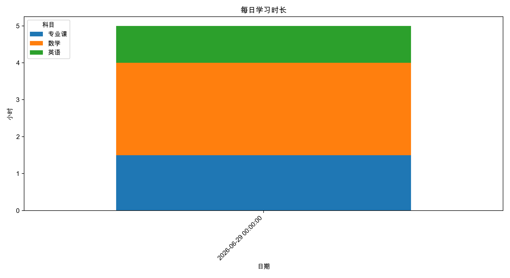
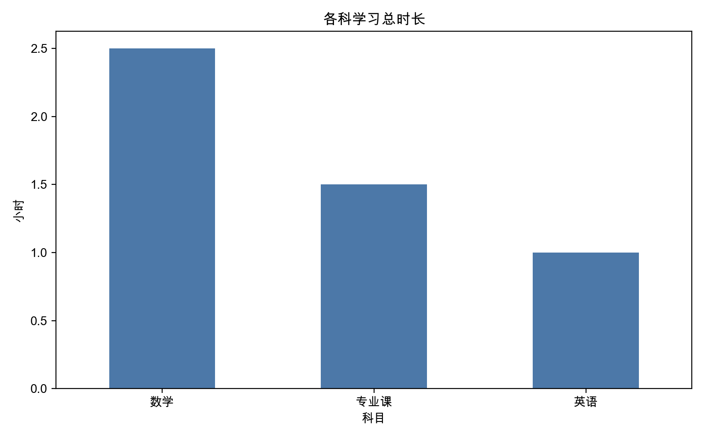
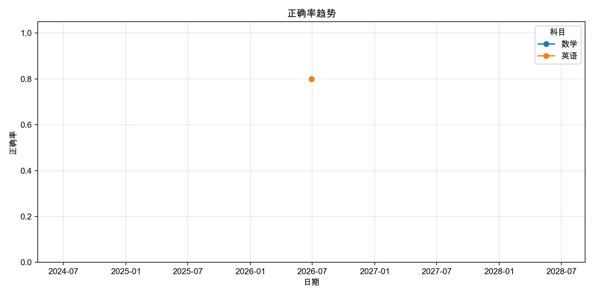

# 我的学习可视化

这个页面由 `tools/generate_personal_dashboard.py` 自动生成。

## 学习时长

- 记录天数：1
- 总学习时长：5.0 小时
- 日均学习时长：5.0 小时





| 科目 | 总时长 |
| --- | --- |
| 数学 | 2.5h |
| 专业课 | 1.5h |
| 英语 | 1.0h |

## 正确率



| 科目 | 综合正确率 |
| --- | --- |
| 数学 | 80.0% |
| 英语 | 80.0% |

## 怎么更新

本地写完每日记录后运行：

```bash
python3 tools/generate_personal_dashboard.py
```

然后提交并推送到 GitHub。
